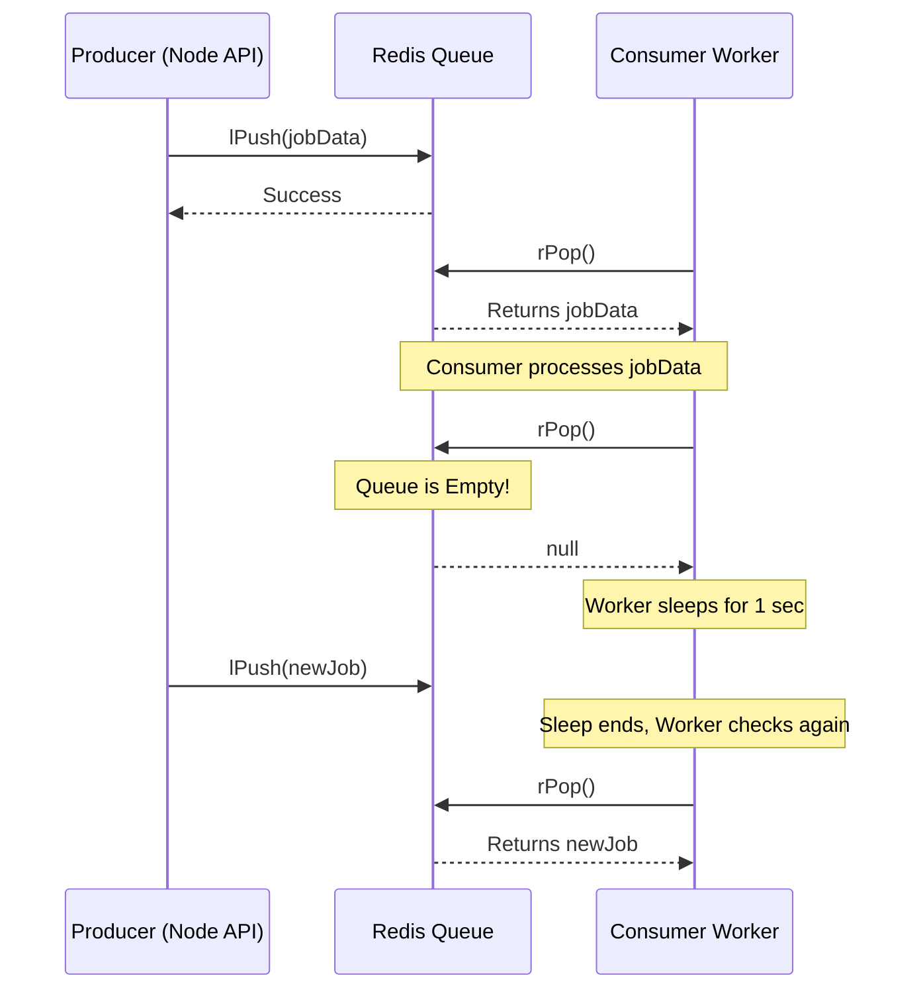

# 1. High-Level System Design Concepts: Producer-Consumer Pattern

## Introduction
The Producer-Consumer pattern is a classic concurrency and system design pattern. It separates the components that generate data (Producers) from the components that process the data (Consumers) using a shared buffer or queue.

## Real-World Analogy
Think of a restaurant kitchen. The **waiter (Producer)** takes orders from customers and places them on a **ticket board (Buffer/Queue)**. The **chef (Consumer)** takes tickets from the board one by one and cooks the meals. They work independently and at different speeds.

## Core Architecture
```mermaid
flowchart LR
    P1[Producer (API)] -->|Generates Task| Q[(Shared Queue / Buffer)]
    P2[Producer (API)] -->|Generates Task| Q
    P3[Producer (API)] -->|Generates Task| Q
    
    Q -->|Fetches Task| C1[Consumer Worker 1]
    Q -->|Fetches Task| C2[Consumer Worker 2]
```

## Why do we use it? (Benefits)
1. **Decoupling**: Producers and consumers don't need to know about each other.
2. **Handling Different Speeds (Asynchrony)**: If producers generate data faster than consumers can process it, the queue absorbs the burst.
3. **Scalability**: You can easily add more producers or consumers independently based on the bottleneck.

## Key Concepts to Know for Interviews

### 1. Blocking vs. Polling Queues
- **Blocking Queue**: The consumer *blocks* (waits) until a new item arrives. This prevents CPU wastage (e.g., Redis `BRPOP`).
- **Polling Queue**: The consumer checks for items, and if none exist, it sleeps for a short duration before checking again (e.g., Redis `RPOP` followed by a `sleep(1000)`). Polling is sometimes required when dealing with serverless environments that drop long-lived idle connections.

### 2. Backpressure
When producers are too fast, the queue fills up. The system must apply *backpressure* by either:
- Blocking the producers.
- Dropping new messages (e.g., lossy systems).
- Scaling up more consumers.

### 3. Starvation
When consumers are too fast or producers are too slow, consumers might starve (remain idle).



## Implementation Example (JavaScript/Node.js with Redis)
In a Node.js ecosystem, you typically implement this pattern using a message broker like Redis. The Producer pushes to a Redis List, and the Consumer continuously polls it.

```javascript
// ====== PRODUCER (API Route) ======
const { getClient } = require('./redis');

async function createJob(jobData) {
    const redis = await getClient();
    
    // Push the job to the left side of the Redis list
    await redis.lPush('queue:normal', JSON.stringify(jobData));
    console.log("Job placed in queue");
}

// ====== CONSUMER (Worker Process) ======
const sleep = (ms) => new Promise(resolve => setTimeout(resolve, ms));

async function startWorker() {
    const redis = await getClient();
    console.log('Worker started — watching queue...');

    while (true) {
        try {
            // Pop the job from the right side of the Redis list
            const jobData = await redis.rPop('queue:normal');
            
            if (jobData) {
                const job = JSON.parse(jobData);
                console.log(`Processing job ${job.id}...`);
                
                // Simulate processing time
                await sleep(500); 
                console.log(`✓ Job ${job.id} completed`);
            } else {
                // Polling backoff: No jobs found. Sleep for 1 sec to avoid spamming Redis
                await sleep(1000);
            }
        } catch (err) {
            console.error('Worker loop error:', err.message);
            await sleep(2000);
        }
    }
}
```

## Common SDE1 Interview Questions

**Q1: What happens if the queue is full?**
*Answer:* Redis Lists technically don't have a strict upper limit (bounded only by memory). However, in memory-constrained systems, if Redis fills up, it will start evicting keys based on its eviction policy or reject new writes. To prevent this, we must either scale consumers or implement API rate limiting (backpressure).

**Q2: How do you handle a scenario where a consumer crashes while processing a task?**
*Answer:* We need an **Acknowledgment (ACK)** mechanism or a persistent source of truth. If we just pop from Redis and crash, the job is lost forever. To fix this, we can store job states in a durable database (like PostgreSQL) first. When the worker pulls the job, it updates the DB to "processing". If the worker crashes, a background sweeper can find jobs stuck in "processing" for too long and re-queue them.

**Q3: How do you ensure tasks are processed in order?**
*Answer:* Using a single list and a single consumer guarantees order. However, if you add multiple consumers for scale, strict ordering is lost because workers process at different speeds. If strict ordering per-user is needed, you use partitioning (like Kafka partitions) where all jobs for User A go to Consumer 1 exclusively.

---

## ⚡ Application in QueueFlow Project

This pattern is the exact backbone of **QueueFlow**. 

**Where and How it is Used in Your Project:**
1. **The Producer (`backend/index.js` & `app.js`)**: When the frontend creates a new job, your Express API generates a record in PostgreSQL (status = `queued`) and then acts as the Producer by pushing the payload into Redis using `redis.lPush(queueKey, data)`.
2. **The Buffer/Queue (`backend/redis.js`)**: Redis Lists act as the queues. You even categorized them by priority (`queue:high`, `queue:normal`, `queue:low`).
3. **The Consumer (`backend/worker.js`)**: Your worker runs an infinite `while (true)` loop pulling from these queues using `redis.rPop()`. It checks the highest priority queue first.
4. **Handling Failures (Idempotency / Atomic Claims)**: QueueFlow brilliantly solves the "consumer crash" problem mentioned in Q2 above by using PostgreSQL as the source of truth. When the worker pulls a job from Redis, it executes an atomic claim query (`UPDATE jobs SET status = 'processing' WHERE id = $1 AND status = 'queued' RETURNING id`). This prevents double processing!
5. **Polling over Blocking**: Instead of using `BRPOP` (blocking pop), your `worker.js` uses `rPop` followed by `sleep(1000)` to accommodate serverless Redis connection limits (like Upstash), which might drop long-lived idle connections.
