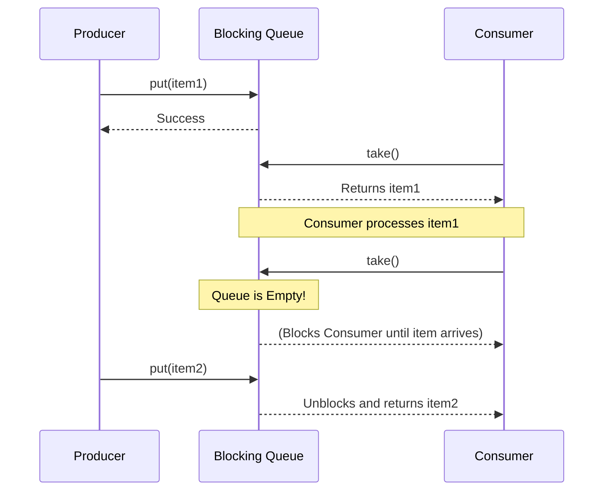

# 1. High-Level System Design Concepts: Producer-Consumer Pattern

## Introduction
The Producer-Consumer pattern is a classic concurrency and system design pattern. It separates the components that generate data (Producers) from the components that process the data (Consumers) using a shared buffer or queue.

## Real-World Analogy
Think of a restaurant kitchen. The **waiter (Producer)** takes orders from customers and places them on a **ticket board (Buffer/Queue)**. The **chef (Consumer)** takes tickets from the board one by one and cooks the meals. They work independently and at different speeds.

## Core Architecture

```mermaid
flowchart LR
    P1[Producer 1] -->|Generates Task| Q[(Shared Queue / Buffer)]
    P2[Producer 2] -->|Generates Task| Q
    P3[Producer 3] -->|Generates Task| Q
    
    Q -->|Fetches Task| C1[Consumer 1]
    Q -->|Fetches Task| C2[Consumer 2]
```


## Why do we use it? (Benefits)
1. **Decoupling**: Producers and consumers don't need to know about each other.
2. **Handling Different Speeds (Asynchrony)**: If producers generate data faster than consumers can process it, the queue absorbs the burst.
3. **Scalability**: You can easily add more producers or consumers independently based on the bottleneck.

## Key Concepts to Know for Interviews

### 1. Blocking vs. Non-Blocking Queues
- **Blocking Queue**: If the queue is full, the producer *blocks* (waits) until there is space. If the queue is empty, the consumer *blocks* until a new item arrives. This prevents CPU wastage.
- **Non-Blocking Queue**: Returns immediately with an error or null if it cannot perform the operation.

### 2. Backpressure
When producers are too fast, the queue fills up. The system must apply *backpressure* by either:
- Blocking the producers.
- Dropping new messages (e.g., lossy systems).
- Scaling up more consumers.

### 3. Starvation
When consumers are too fast or producers are too slow, consumers might starve (remain idle).



## Implementation Example (Java)
In SDE1 interviews, you might be asked to implement this using Wait/Notify or Semaphores. Here is a simple implementation using Java's built-in `BlockingQueue`, which handles synchronization for you.

```java
import java.util.concurrent.BlockingQueue;
import java.util.concurrent.LinkedBlockingQueue;

public class ProducerConsumerExample {
    public static void main(String[] args) {
        // Shared bounded buffer of size 5
        BlockingQueue<Integer> queue = new LinkedBlockingQueue<>(5);

        // Producer Thread
        Thread producer = new Thread(() -> {
            try {
                for (int i = 1; i <= 10; i++) {
                    System.out.println("Produced: " + i);
                    queue.put(i); // Blocks if queue is full
                    Thread.sleep(100); // Simulate some work
                }
            } catch (InterruptedException e) {
                Thread.currentThread().interrupt();
            }
        });

        // Consumer Thread
        Thread consumer = new Thread(() -> {
            try {
                while (true) {
                    Integer item = queue.take(); // Blocks if queue is empty
                    System.out.println("Consumed: " + item);
                    Thread.sleep(500); // Simulate slower consumption
                }
            } catch (InterruptedException e) {
                Thread.currentThread().interrupt();
            }
        });

        producer.start();
        consumer.start();
    }
}
```

## Common SDE1 Interview Questions

**Q1: What happens if the queue is full?**
*Answer:* It depends on the design. If it's a bounded Blocking Queue, the producer thread will wait (block) until space becomes available. In a distributed system (like Kafka or RabbitMQ), you might configure backpressure mechanisms or start dropping messages if TTL (Time To Live) expires.

**Q2: How do you handle a scenario where a consumer crashes while processing a task?**
*Answer:* We use an **Acknowledgment (ACK)** mechanism. When a consumer picks a task, it's not immediately deleted from the queue; it's made "invisible". If the consumer successfully processes it, it sends an ACK, and the task is deleted. If the consumer crashes and no ACK is received within a timeout period, the task becomes visible again for another consumer to process (Message Retry).

**Q3: How do you ensure tasks are processed in order?**
*Answer:* The standard Producer-Consumer pattern with multiple consumers does *not* guarantee strict ordering because consumers process at different speeds. To guarantee order, you either need a single consumer, or you must use concepts like Kafka's "Partitions" where messages with the same key go to the same partition, and a partition is consumed by exactly one consumer.
