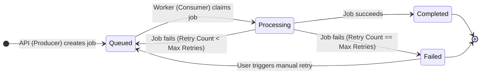

# 2. Job Lifecycle & State Machine

Understanding the lifecycle of a job—from the moment a user creates it until it finishes or permanently fails—is the core of building a reliable background queue. In distributed systems, jobs do not simply run; they transition through a highly controlled **State Machine**.

## 1. What is a State Machine?
A Finite State Machine (FSM) is a mathematical model of computation where a system can only be in exactly one of a finite number of states at any given time. It transitions from one state to another in response to external inputs. 

In the context of job queues, a state machine ensures that a job moves predictably through the system and prevents chaotic scenarios (like a job being marked "completed" and "queued" at the same time).

### Visualizing the Job Lifecycle



## 2. The Four Core States
1. **Queued (Waiting):** The job has been saved to the database and pushed to Redis. It is waiting for an available worker to pick it up.
2. **Processing (Active):** A worker has exclusively claimed the job and is currently executing its logic. 
3. **Completed (Resolved):** The worker successfully finished the task. The job is done and will never be processed again.
4. **Failed (Dead-Letter):** The job encountered an error, exhausted all of its allowed retries, and has been permanently halted. It requires manual intervention.

## 3. Key Design Decisions & Trade-offs

### Why is Status Tracked in PostgreSQL, Not Redis?
Redis is incredibly fast, making it perfect for the actual "Queue" (the physical line of jobs waiting to be processed). However, Redis is fundamentally an in-memory datastore. If Redis crashes, or if keys are evicted due to memory limits, the state of the job is lost forever.
By storing the **source of truth** for the job's state in PostgreSQL (a persistent relational database), we gain ACID guarantees. Even if Redis is completely wiped, we can look at PostgreSQL, see which jobs are stuck in the "Queued" state, and re-push them to Redis (Crash Recovery).

### Atomic Status Claims (Preventing Double-Processing)
When you have multiple workers running concurrently across different servers, two workers might try to grab the exact same job at the exact same millisecond. 
To prevent both workers from processing the same job (e.g., sending the same email to a user twice), we use a database-level lock called an **Atomic Claim**.

Instead of:
1. `SELECT * FROM jobs WHERE id = 123`
2. *(Worker sees it is 'queued')*
3. `UPDATE jobs SET status = 'processing' WHERE id = 123`

We combine it into a single, indivisible (atomic) operation:
```sql
UPDATE jobs 
SET status = 'processing', updated_at = NOW() 
WHERE id = $1 AND status = 'queued' 
RETURNING id;
```
If two workers execute this query simultaneously, PostgreSQL's internal locking mechanisms guarantee that only **one** worker will successfully update the row and receive the `RETURNING id`. The second worker will affect 0 rows and know that it lost the race.

### Stale Redis Entry Handling
Because Redis and PostgreSQL are two separate systems, they can occasionally fall out of sync. For example, a user might manually delete or cancel a job in PostgreSQL, but its ID is still floating in the Redis List.
When a worker pops this "stale" job ID from Redis and attempts the atomic claim in PostgreSQL, the `UPDATE` query will return 0 rows. The worker safely ignores the job and moves on to the next one.

### The Dead-Letter Queue (DLQ) Concept
A Dead-Letter Queue is a holding area for messages or jobs that cannot be processed successfully. If a job fails because of a temporary issue (like a network timeout), it should be retried. But if it fails consistently (e.g., a malformed email address), retrying it forever will clog up the queue.
When a job hits `max_retries` (default is 3), it is transitioned to the **Failed** state. This acts as our Dead-Letter Queue. Engineers can later inspect these failed jobs, fix the underlying bug, and manually push them back to the `Queued` state.

## 4. Retries and Error Persistence
When a job fails, the worker catches the error. Before throwing the job away, it checks the `retry_count`.
- If `retry_count < max_retries`: The worker increments the retry count, saves the error message to PostgreSQL (so developers can see what went wrong), and sets the status back to `Queued`.
- The job is then re-pushed to Redis using **Exponential Backoff** (waiting 2s, then 4s, then 8s) to give the failing external service time to recover.

---

## ⚡ Application in QueueFlow Project

Here is exactly how this is implemented in your `QueueFlow` Node.js codebase:

**1. The Atomic Claim (`worker.js`):**
When `BRPOP` gives the worker a job ID, it immediately hits PostgreSQL to claim it:
```javascript
const processingToken = randomUUID(); // Unique lock for this exact worker process
const claimResult = await pool.query(
  `UPDATE jobs 
   SET status = 'processing', processing_token = $2, updated_at = NOW() 
   WHERE id = $1 AND status = 'queued' 
   RETURNING id`,
  [jobId, processingToken]
);

// Stale Entry Handling: If another worker got it first, or it was deleted, ignore it.
if (claimResult.rowCount === 0) {
  console.log(`[Worker] Job ${jobId} is no longer queued. Skipping.`);
  return;
}
```

**2. The State Machine Transitions (`worker.js`):**
If the `processJob()` function throws an error, the catch block manages the state transition:
```javascript
catch (error) {
  // 1. Fetch current retry state (authenticating with our processingToken)
  const retryCheck = await pool.query(
    `SELECT retry_count, max_retries FROM jobs 
     WHERE id = $1 AND status = 'processing' AND processing_token = $2`, 
    [jobId, processingToken]
  );
  const { retry_count, max_retries } = retryCheck.rows[0];

  if (retry_count < max_retries) {
    // 2. Transition back to Queued (Retry) and clear the lock
    await pool.query(
      `UPDATE jobs 
       SET retry_count = $1, status = 'queued', processing_token = NULL, error = $2, updated_at = NOW() 
       WHERE id = $3 AND status = 'processing' AND processing_token = $4`,
      [retry_count + 1, error.message, jobId, processingToken]
    );
    // Add to Redis ZSET for Exponential Backoff...
  } else {
    // 3. Transition to Failed (Dead-Letter) and clear the lock
    await pool.query(
      `UPDATE jobs 
       SET status = 'failed', processing_token = NULL, error = $1, updated_at = NOW() 
       WHERE id = $2 AND status = 'processing' AND processing_token = $3`,
      [error.message, jobId, processingToken]
    );
  }
}
```

---

## 🎤 SDE1 Interview Questions & Answers

### Q1: "If multiple workers pull the same job ID from Redis at the exact same time, how do you prevent them from both processing it?"
**Answer:** "Redis `BRPOP` is inherently atomic, so normally only one worker gets the ID. However, to be absolutely certain and to handle edge cases (like crash recovery pushing duplicates), I rely on a PostgreSQL atomic claim. When the worker gets the ID, it executes an `UPDATE jobs SET status = 'processing' WHERE id = X AND status = 'queued'`. Because of PostgreSQL's row-level locking, only one worker will successfully update the row and proceed. The others will receive 0 affected rows and drop the job."

### Q2: "Why did you choose to store the job status in PostgreSQL instead of just using Redis?"
**Answer:** "Redis is used for the high-throughput, in-memory queueing (the `LIST`), but PostgreSQL is used as the persistent source of truth. If Redis crashes or gets flushed, I lose my queue. But because the actual state (`queued`, `processing`, `completed`) is safely on disk in Postgres, I wrote a `recoverMissingQueuedJobs` script that simply queries Postgres for any jobs still marked as 'queued' and re-pushes them to Redis on startup."

### Q3: "What is a Dead-Letter Queue and how did you implement it?"
**Answer:** "A Dead-Letter Queue (DLQ) is a storage area for messages that cannot be processed successfully after multiple attempts. In my system, if a job fails, the worker increments a `retry_count`. Once that count hits `max_retries` (which defaults to 3), the worker updates the job's status in PostgreSQL to `'failed'` and logs the error message. It is not pushed back to Redis. These failed jobs act as my DLQ, which I can view in my React dashboard and manually retry once the underlying bug is fixed."

### Q4: "What happens if a worker crashes right in the middle of the 'processing' state?"
**Answer:** "This is a classic distributed systems problem known as the 'stuck in processing' issue. If a worker dies, the job remains in PostgreSQL with a status of `processing`, but it is no longer in Redis. To solve this, I built a background maintenance loop into the worker process (`recoverStalledProcessingJobs`). Every 15 seconds, it queries PostgreSQL for any jobs where `status = 'processing' AND updated_at < NOW() - INTERVAL '60 seconds'`. If a job has been processing for over 60 seconds, it safely assumes the worker died, wipes the `processing_token`, transitions it back to `queued`, and re-pushes it to Redis so a healthy worker can grab it."
