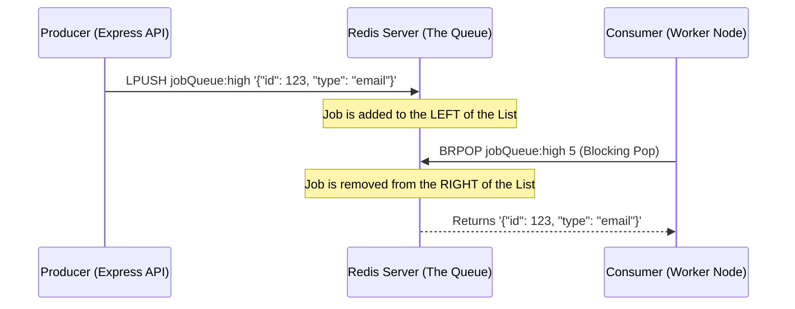

# 3. Redis — Concepts & Commands Used

Redis (Remote Dictionary Server) is an open-source, in-memory, key-value data store. In modern backend architectures, it is the undisputed champion of caching, session management, and **message queueing**.

In `QueueFlow`, Redis serves as the high-speed "broker" that holds jobs temporarily while they wait for a worker to process them.

## 1. Core Redis Concepts

* **In-Memory Speed:** Because Redis stores data in RAM (instead of on a hard drive like PostgreSQL), reading and writing is incredibly fast (sub-millisecond latency). This makes it perfect for a queue where jobs are constantly being added and removed.
* **Single-Threaded Architecture:** Redis processes commands sequentially in a single thread. This inherently prevents race conditions—if two clients try to push to a list at the exact same time, Redis simply processes one after the other.
* **The LIST Data Structure:** Redis supports Strings, Hashes, Sets, etc. For our primary active queues, we use **Lists**. A Redis List is simply a sequence of strings, kept in order. It operates exactly like a Linked List.
* **The ZSET (Sorted Set) Data Structure:** A set where every element is associated with a floating-point number called a *score*. Redis keeps the set sorted by this score. We use this for our delayed retry queues, where the "score" is the exact UNIX timestamp when the job is due.
* **Pub/Sub (Publish/Subscribe):** A messaging paradigm where senders (publishers) send messages to channels, and receivers (subscribers) listen to those channels. We use this for real-time WebSocket syncing.

### Visualizing the Redis Queue (LPUSH & BRPOP)



## 2. The Raw Commands We Used

Most developers use libraries like `BullMQ` or `Celery`, which hide what Redis is actually doing. By building this from scratch, we used raw Redis commands.

### `LPUSH` (Left Push)
* **What it does:** Inserts a new element at the "head" (left side) of a list.
* **Time Complexity:** $O(1)$. It takes the exact same amount of time regardless of how big the queue is.
* **Usage:** Used by the API to push a newly created job into the queue.

### `BRPOP` (Blocking Right Pop)
* **What it does:** Removes and returns the last element (right side) of a list. If the list is empty, **it blocks the connection** until another client pushes to the list.
* **Why it's amazing:** Standard polling (`RPOP`) requires you to check the queue every second in a loop (`while(true) { check() }`), which wastes massive amounts of CPU and network bandwidth. `BRPOP` simply goes to sleep and wakes up the exact millisecond a job arrives. Zero wasted CPU.

### `ZADD`, `ZRANGEBYSCORE`, and `ZREM`
* **`ZADD`:** Adds an element to a sorted set with a specific score. We use this to schedule failed jobs for retry in the future (score = `Date.now() + delay`).
* **`ZRANGEBYSCORE`:** Fetches elements from the ZSET that have a score between a `min` and `max`. Our maintenance loop runs this on every worker iteration (`min=0`, `max=current_timestamp`) to find jobs whose retry backoff delay has expired.
* **`ZREM`:** Removes elements from the ZSET after we fetch them, so we can safely `LPUSH` them back into the active lists.

### `PUBLISH` and `SUBSCRIBE`
* **`PUBLISH`:** Broadcasts a message to a specific channel (e.g., `redis.publish('job_updates', data)`).
* **`SUBSCRIBE`:** Listens to a channel. Used by our Express API to listen to worker state changes and forward them to the React frontend via WebSockets.

### `DEL` and `LLEN`
* **`DEL`:** Deletes a key entirely. Used when we hit the "Purge All" button on the dashboard to clear the queue instantly.
* **`LLEN`:** Returns the length of the list. We use this to power the `queued` count on the dashboard metrics.

## 3. Key Design Decisions

### The Duplicate Client Problem (`redis.duplicate()`)
Because `BRPOP` completely blocks the Redis connection until a job arrives, you cannot use that same connection to do anything else (like `LPUSH`ing a new job). 
To solve this, we create two separate Redis connections in our app:
1. `redis` (Main Client) — Used for pushing jobs, fetching lengths, and Pub/Sub.
2. `redisSub` or a duplicate client — Exclusively dedicated to waiting on `BRPOP` or listening to channels.

### Prioritization via Multiple Keys
Instead of building a complex sorting algorithm, we implemented Priority Queues the "Redis Way"—by using multiple Lists.
We have three keys: `jobQueue:high`, `jobQueue`, and `jobQueue:low`.
When we call `BRPOP jobQueue:high jobQueue jobQueue:low 5`, Redis automatically checks the keys in that exact order. It will always drain the `high` list before it even looks at the `normal` list.

---

## ⚡ Application in QueueFlow Project

Here is how these concepts are translated into code in your project.

**1. Pushing a Job (`app.js`)**
When a user clicks "Create job", the API determines the correct priority key and pushes the payload:
```javascript
const targetQueue = queues.queueKeyForPriority(priority);
// Output: "jobQueue:high"

await redis.lPush(targetQueue, JSON.stringify(jobPayload));
```

**2. Blocking for Jobs (`worker.js`)**
The worker enters an infinite loop and blocks for up to 5 seconds (`BRPOP_TIMEOUT_SECONDS`):
```javascript
while (true) {
  // Block for up to 5 seconds across all 3 priority queues
  const result = await redis.brPop(
    queues.QUEUES_IN_PRIORITY_ORDER, // ['jobQueue:high', 'jobQueue', 'jobQueue:low']
    5 
  );
  
  if (result) {
    const { key, element } = result;
    const rawData = JSON.parse(element);
    await handleJob(rawData, redis);
  }
}
```

**3. Durable Exponential Backoff (`worker.js`)**
When a job fails, we calculate a backoff (e.g., 2000ms) and use a ZSET to schedule the retry:
```javascript
const score = Date.now() + backoffMs;
await redis.zAdd('delayed_queue', [{ score, value: JSON.stringify(jobPayload) }]);
```
A maintenance loop runs on every worker iteration to promote them back:
```javascript
const now = Date.now();
const dueJobs = await redis.zRangeByScore('delayed_queue', 0, now);
for (const jobStr of dueJobs) {
  await redis.zRem('delayed_queue', jobStr);
  await enqueueJob(redis, JSON.parse(jobStr)); // does LPUSH
}
```

**4. Real-time Pub/Sub Syncing (`app.js` & `index.js`)**
When the worker updates a job to `processing`, it broadcasts it:
```javascript
await redis.publish('job_updates', JSON.stringify(job));
```
The API server listens to this channel and emits a WebSocket event to React:
```javascript
await redisSub.subscribe('job_updates', (message) => {
  io.emit('job_updated', JSON.parse(message));
});
```

---

## 🎤 SDE1 Interview Questions & Answers

### Q1: "Why did you choose Redis instead of a message broker like RabbitMQ or Kafka?"
**Answer:** "Redis is incredibly lightweight, easy to deploy, and blazing fast because it's purely in-memory. For `QueueFlow`, I didn't need the heavy durability guarantees of Kafka (since I'm using PostgreSQL as my persistent source of truth), nor did I need the complex routing topology of RabbitMQ. The `LPUSH` and `BRPOP` primitives gave me exactly what I needed to build a highly concurrent, priority-based queue from scratch."

### Q2: "What is the difference between RPOP and BRPOP, and why did you use BRPOP?"
**Answer:** "`RPOP` is a standard pop that returns `null` if the list is empty. If I used `RPOP`, my worker would have to sit in a `while(true)` loop calling it constantly (polling). This would hammer the Redis server and waste CPU cycles. `BRPOP` is the blocking version. It tells Redis, 'I want to pop an item, and if the list is empty, put this connection to sleep until an item arrives or a timeout is reached.' This gives me instant job processing with zero CPU waste."

### Q3: "How does your system handle priority queues using Redis?"
**Answer:** "Redis `BRPOP` actually accepts an array of keys. I created three separate lists: `jobQueue:high`, `jobQueue`, and `jobQueue:low`. When the worker calls `BRPOP`, I pass all three keys in that exact order. Redis guarantees that it will always check the `high` key first. If it's empty, it checks the `normal` key, and so on. This gave me strict priority processing without needing to use heavier data structures for the active queues."

### Q4: "How did you implement exponential backoff for failed jobs?"
**Answer:** "When a job fails, I don't want to re-queue it immediately because it will cause a thundering herd. Instead, I calculate a delay (2s, 4s, 8s) and use a Redis Sorted Set (`ZSET`). I set the 'score' of the job to `Date.now() + delay` and use `ZADD`. A background maintenance loop runs `ZRANGEBYSCORE` to find jobs whose timestamps have expired, removes them with `ZREM`, and pushes them back into the active `LIST`s. Because it's stored in a Redis ZSET, the timers are 100% durable even if the worker crashes!"

### Q5: "Since Redis is single-threaded, does that mean your Node.js workers can only process one job at a time?"
**Answer:** "No! Redis is single-threaded, meaning it only executes one *command* at a time, making `LPUSH` and `BRPOP` safe from race conditions. But my Node.js workers run in separate processes (or separate machines entirely). Because Redis is so fast, it can hand out jobs to hundreds of horizontal worker processes almost instantly. The actual processing of the job (which takes time) happens in the worker's CPU, completely independent of Redis."
