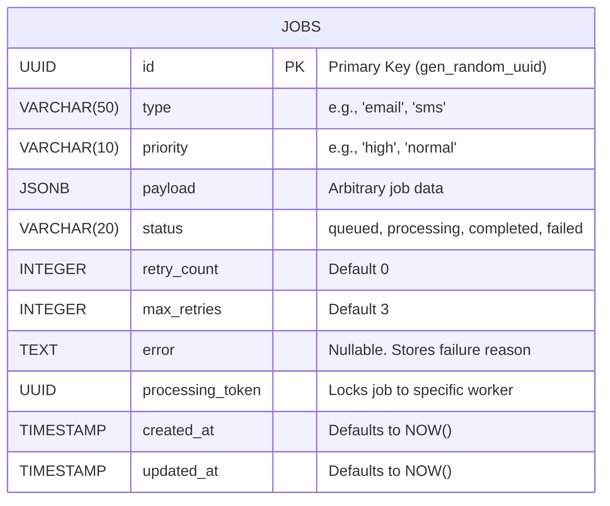

# 4. PostgreSQL — Concepts & SQL Used

While Redis acts as the lightning-fast waiting room for jobs, **PostgreSQL** is the permanent vault. It is a powerful, open-source object-relational database system that guarantees your job data is never lost, even if the entire server cluster loses power.

## 1. Core Database Concepts

### Why a Relational Database? (The ACID Properties)
PostgreSQL provides **ACID** guarantees, which are critical for systems managing state:
* **Atomicity:** An operation (like claiming a job) is "all or nothing." It either completely succeeds or completely fails.
* **Consistency:** The data always adheres to defined rules (e.g., UUIDs must be valid, enums like 'high' or 'low' must match).
* **Isolation:** Multiple workers can hit the database at the exact same time without interfering with each other (Row-Level Locking).
* **Durability:** Once a job is `INSERT`ed and confirmed, it is written to disk. A crash won't erase it.

### Connection Pooling (`pg.Pool`)
Opening a brand-new connection to a database over the network is slow. Instead of connecting and disconnecting for every single query, Node.js uses a **Connection Pool**. 
A pool maintains a set of open connections. When the Express API gets a request, it "borrows" a connection, runs the query, and hands it back to the pool. This allows massive concurrency.

## 2. The Database Schema

Your `QueueFlow` system relies on a single, highly optimized table named `jobs`.



### Why `JSONB` for the Payload?
PostgreSQL has a superpower: the `JSONB` column type. Instead of forcing you to create specific columns for an email address, an SMS number, or a PDF URL, `JSONB` allows you to store arbitrary JSON data. PostgreSQL stores it in a parsed binary format, meaning you can actually query inside the JSON objects efficiently, giving you the flexibility of MongoDB with the safety of SQL.

## 3. SQL Queries in Action

Unlike ORMs (like Prisma or TypeORM) which hide the SQL, you wrote raw queries to maximize performance. Here are the most critical ones:

### The Atomic Claim (UPDATE ... RETURNING)
```sql
UPDATE jobs 
SET status = 'processing', processing_token = $2, updated_at = NOW() 
WHERE id = $1 AND status = 'queued' 
RETURNING id, type, payload;
```
* **Why it's important:** If two workers run this query on the same `id` simultaneously, Postgres locks the row. The first one gets the data returned. The second gets 0 rows back. The `processing_token` (a random UUID) securely binds the job to that specific worker process.

### The Dashboard Feed (ORDER BY & LIMIT)
```sql
SELECT * FROM jobs 
ORDER BY created_at DESC 
LIMIT 200;
```
* **Why it's important:** You don't want to load 10 million rows into the React dashboard. Limiting to 200 ensures the API responds in milliseconds, while `ORDER BY` ensures you see the newest jobs first.

### The Stats Aggregation (COUNT FILTER)
To generate the metrics for the dashboard without running 5 different queries, we use `FILTER`:
```sql
SELECT 
  COUNT(*) as total,
  COUNT(*) FILTER (WHERE status = 'queued') as queued,
  COUNT(*) FILTER (WHERE status = 'processing') as processing,
  AVG(EXTRACT(EPOCH FROM (updated_at - created_at))) FILTER (WHERE status = 'completed') as avg_completion
FROM jobs;
```
* **Why it's important:** This calculates totals for every single pipeline lane in exactly **one** database round-trip.

## 4. Indexing (Making it Fast)
If you have 1 million rows and run `WHERE status = 'queued'`, Postgres normally scans all 1 million rows one-by-one (Sequential Scan).
To fix this, we created **Indexes**:
* `idx_jobs_status` on `(status)`: Makes the dashboard counts and filters lightning fast.
* `idx_jobs_created_at` on `(created_at DESC)`: Makes the dashboard feed (`ORDER BY created_at DESC LIMIT 200`) instant.
* `idx_jobs_status_updated_at` on `(status, updated_at)`: A composite index that empowers our cron loop to instantly find jobs stuck in processing for over 60 seconds (`status = 'processing' AND updated_at < ...`) without scanning the entire database.
An index is like the index at the back of a textbook—Postgres instantly looks up where the data is and jumps straight to it, turning an $O(N)$ scan into an $O(log N)$ tree traversal.

---

## ⚡ Application in QueueFlow Project

Here is how these concepts are utilized in your specific codebase:

**1. Connection Pooling (`db.js`)**
You initialize a shared pool that both `app.js` (API) and `worker.js` (Consumer) import:
```javascript
const { Pool } = require('pg');

const pool = new Pool({
  connectionString: process.env.DATABASE_URL,
  ssl: { rejectUnauthorized: false } // Required for Neon/AWS
});

module.exports = pool;
```

**2. Idempotent Migrations (`migrate.js`)**
When setting up the database, you use `IF NOT EXISTS`. This means the migration script can be run 100 times safely without crashing:
```sql
CREATE EXTENSION IF NOT EXISTS "pgcrypto";
CREATE TABLE IF NOT EXISTS jobs ( ... );
CREATE INDEX IF NOT EXISTS idx_jobs_status ON jobs(status);
CREATE INDEX IF NOT EXISTS idx_jobs_status_updated_at ON jobs(status, updated_at);
```

**3. Parameterized Queries to Prevent SQL Injection (`app.js`)**
Instead of using string concatenation (`"INSERT INTO jobs VALUES (" + id + ")"`), you use parameterized arrays. This prevents hackers from dropping your database tables:
```javascript
await pool.query(
  'INSERT INTO jobs (id, type, priority, payload) VALUES ($1, $2, $3, $4)',
  [jobId, type, priority, payload]
);
```

---

## 🎤 SDE1 Interview Questions & Answers

### Q1: "Why use PostgreSQL for the queue state instead of a NoSQL database like MongoDB?"
**Answer:** "A job queue requires strict transactional integrity. When multiple workers are competing for jobs, I rely on PostgreSQL's row-level locking and ACID guarantees (specifically the `UPDATE ... RETURNING` atomic query) to ensure a job is only processed once. While MongoDB supports transactions, PostgreSQL is fundamentally designed for these highly concurrent, structured updates. Plus, using PostgreSQL's `JSONB` column gives me NoSQL-like flexibility for job payloads without sacrificing SQL safety."

### Q2: "What is an SQL Injection attack, and how does your code prevent it?"
**Answer:** "SQL Injection happens when untrusted user input is directly concatenated into a raw SQL string, allowing hackers to execute malicious commands like `DROP TABLE`. In `QueueFlow`, I never concatenate strings. I use the `pg` library's parameterized queries (e.g., `VALUES ($1, $2)`). The Postgres driver safely escapes all inputs before they reach the database engine, neutralizing the attack."

### Q3: "Your dashboard shows statistics for 'queued', 'processing', and 'failed' jobs. Are you running 3 different queries to get that data?"
**Answer:** "No, that would be inefficient and increase database latency. I calculate all the statistics using a single aggregate query. I use the `COUNT(*) FILTER (WHERE condition)` syntax in PostgreSQL. This allows the database to scan the table just once and return all the different counts and averages in a single JSON row, which my Express API then forwards to the React dashboard."

### Q4: "What is Connection Pooling and why did you use `pg.Pool` instead of `pg.Client`?"
**Answer:** "If I used a single `Client`, my entire Express server would only be able to process one database request at a time, creating a massive bottleneck. If I created a *new* Client for every request, the overhead of establishing a TCP connection would destroy performance. `pg.Pool` maintains a reusable pool of active connections. When a request comes in, it instantly borrows a connection from the pool, runs the query, and returns it, allowing my API to handle thousands of concurrent requests smoothly."
