# 2. Complete Application Flow

This document maps the exact, step-by-step journey of a job as it travels through your entire application. It connects the conceptual architecture directly to the specific files and functions in your repository.

---

## 🌊 The End-to-End User Flow (Visualized)

```mermaid
sequenceDiagram
    autonumber
    actor User as User (React UI)
    participant API as app.js (Express)
    participant DB as db.js (Postgres)
    participant Redis as redis.js (Cache/PubSub)
    participant Worker as worker.js (Consumer)

    User->>API: Clicks "Add Job" (POST /jobs)
    
    rect rgb(20, 50, 20)
        Note right of API: 1. Producer Lifecycle
        API->>DB: INSERT INTO jobs (status='queued')
        DB-->>API: Returns Row (UUID)
        API->>Redis: PUBLISH 'job_updates'
        API->>Redis: LPUSH jobQueue:priority
    end
    
    API-->>User: 200 OK (Job ID)

    rect rgb(20, 20, 50)
        Note right of Redis: 2. Consumer Lifecycle
        Worker->>Redis: BRPOP (Blocks & Waits)
        Redis-->>Worker: Instantly returns job JSON
        Worker->>DB: UPDATE jobs SET status='processing' RETURNING *
    end
    
    Worker->>Redis: PUBLISH 'job_updates' (Processing)
    
    rect rgb(50, 20, 20)
        Note right of Worker: 3. Execution & Result
        Worker->>Worker: processJob() executes
        Worker->>DB: UPDATE jobs SET status='completed'
    end
    
    Worker->>Redis: PUBLISH 'job_updates' (Completed)
    
    rect rgb(50, 50, 20)
        Note right of Redis: 4. Real-time UI Sync
        Redis-->>API: Subscribe Listener Hears Update
        API->>User: Socket.io emit('job_updated')
    end
```

---

## 📂 Step-by-Step Execution (File by File)

### Phase 1: The Trigger (`app.js`)
*   **What Happens:** A user clicks a button on the React dashboard or runs the `simulate.js` burst script. This sends an HTTP POST request to your Express server.
*   **File Operating:** `app.js` (Route: `POST /jobs`)
*   **Core Mechanism:** 
    1. The API validates the request payload (type and priority).
    2. It generates a UUID.
    3. It securely executes a parameterized `INSERT` query into PostgreSQL (via `db.js`), setting the initial status to `queued`.
    4. It broadcasts a WebSocket update via Redis Pub/Sub (`PUBLISH 'job_updates'`).
    5. Finally, it routes the job into the correct Redis List (e.g., `jobQueue:high`) using `LPUSH`.

### Phase 2: The Silent Ambush (`worker.js`)
*   **What Happens:** The worker instantly receives the job without polling the database.
*   **File Operating:** `worker.js` (Function: `runWorkerLoop()`)
*   **Core Mechanism:** 
    1. The worker process is stuck in an infinite `while(true)` loop.
    2. It uses `redisBlocker.brPop(QUEUES, 5)`, which puts the network connection to sleep.
    3. The absolute millisecond `app.js` pushes the job to Redis, Redis wakes up the worker and hands it the JSON payload.

### Phase 3: The Atomic Lock (`worker.js` & `db.js`)
*   **What Happens:** The worker proves it has exclusive rights to the job.
*   **File Operating:** `worker.js` (Function: `handleJob()`)
*   **Core Mechanism:**
    1. The worker generates a unique `processing_token`.
    2. It executes the Atomic Claim in Postgres: `UPDATE jobs SET status = 'processing', processing_token = $2 WHERE id = $1 AND status = 'queued' RETURNING *`.
    3. If the query returns 1 row, the worker proceeds. If it returns 0 rows (meaning another worker stole it first), it aborts.
    4. The worker publishes a `processing` update to Redis Pub/Sub.

### Phase 4: Execution & Resolution (`worker.js`)
*   **What Happens:** The heavy lifting is done, and the final state is recorded.
*   **File Operating:** `worker.js` (Function: `processJob()` and the `try/catch` block)
*   **Core Mechanism:**
    1. The worker executes `processJob()`. In a real app, this is where it sends an email or generates a PDF.
    2. **If Success:** It updates Postgres: `status = 'completed', error = NULL`.
    3. **If Failure:** The `catch` block checks retries. If retries remain, it updates Postgres to `queued`, calculates exponential backoff (`2000 * 2^retry`), and schedules a retry in Redis (`ZADD delayed_queue`). If no retries remain, it updates Postgres to `failed`.
    4. It publishes the final state to Redis Pub/Sub.

### Phase 5: The Real-time Reflection (`app.js`)
*   **What Happens:** The user's screen magically updates without them refreshing the page.
*   **File Operating:** `app.js` (The WebSocket `io.on('connection')` block)
*   **Core Mechanism:**
    1. `app.js` has a secondary, dedicated Redis client (`redisSub`) constantly listening to the `job_updates` channel.
    2. When the worker publishes the 'completed' or 'failed' event, `app.js` hears it.
    3. It parses the JSON and instantly uses Socket.io (`io.emit`) to blast the new job state down to the React frontend.

---

## 🗣️ Exact Interview Script: Walking Through the Architecture

When the interviewer says: **"Walk me through the lifecycle of a job in your system from start to finish."**

> **Your Exact Script:**
> 
> "I'll trace the path of a job from the UI all the way to completion. 
> 
> **Phase 1 is the Producer.** It starts when a user clicks 'Submit' on the React frontend. My Express API receives the payload. The very first thing I do is generate a UUID and `INSERT` the job into PostgreSQL with a status of 'queued'. This is my Database-First Guarantee—if the server crashes a millisecond later, the job is safely on disk. Once it's in Postgres, the API pushes the job payload into a Redis List using `LPUSH` based on its priority.
> 
> **Phase 2 is the Consumer.** On a completely separate server process, my worker node is running an infinite loop. Instead of polling Redis and wasting CPU, it uses the `BRPOP` command. This blocks the connection, putting it to sleep. The millisecond the API pushes the job into Redis, Redis instantly wakes up the worker and hands it the payload.
> 
> **Phase 3 is the Atomic Lock.** Just because the worker got the ID from Redis doesn't mean it's safe to process—network glitches can create duplicate IDs. So, the worker takes that ID, generates a random processing token, and hits PostgreSQL with an `UPDATE ... RETURNING` query. It says: 'Update this job to *processing* ONLY IF it is still *queued*.' Postgres uses row-level locking to guarantee that if 5 workers try this at the exact same time, only 1 wins. 
> 
> **Phase 4 is Execution.** The winning worker does the heavy lifting. If it succeeds, it updates Postgres to 'completed'. If it throws an error, my `catch` block calculates an Exponential Backoff delay—like 4 or 8 seconds—and uses a Redis Sorted Set (`ZADD`) to safely schedule the retry without blocking the main worker thread.
> 
> **Finally, Phase 5 is the UI Sync.** Throughout this entire process, whenever the worker changes the database state, it fires a Redis `PUBLISH` event. My Express server is subscribed to this channel. It hears the updates and uses Socket.io to instantly push the new state down to the React frontend, so the user sees the progress bar move in real-time without ever refreshing the page."
