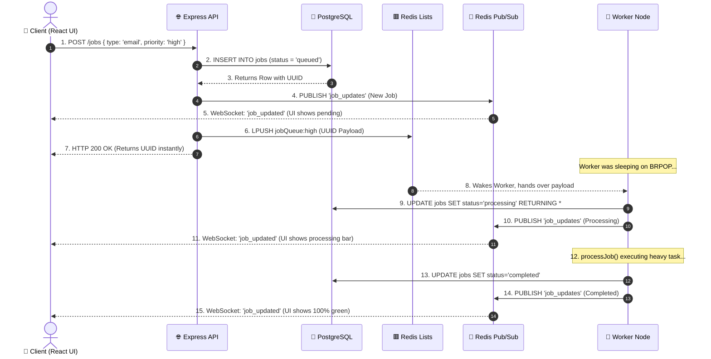

# 2. Complete User & System Flow

This document maps the exact, step-by-step journey of a job from the moment a user clicks a button to the millisecond the background worker resolves it. It is broken down into macro (high-level) and micro (code-level) flows.

---

## 🌊 1. The Macro Flow: The User Journey



---

## 🔍 2. The Micro Flows: Step-by-Step Code Execution

### Phase 1: The Trigger & Producer Initialization
**Trigger:** The user clicks the "Send Campaign" button on the frontend.
**File Operating:** `backend/app.js`

1.  **Validation:** The Express route `POST /jobs` intercepts the JSON payload. It checks if `type` exists and is valid (e.g., 'email', 'sms') and validates the `priority`.
2.  **ID Generation:** It generates a universally unique identifier (`uuidv4()`).
3.  **Database Durability (The First Write):** It securely calls `pool.query('INSERT INTO jobs...')`, injecting the payload into the `JSONB` column and hardcoding the status to `'queued'`.
4.  **Early Notification:** Before it even touches the queue, the API calls `redis.publish('job_updates', payload)`. This instantly pushes a WebSocket event to the user's browser, updating the dashboard to show a new pending job.
5.  **Queue Injection (The Second Write):** Finally, it evaluates the priority string and routes the payload to the correct Redis list: `await redis.lPush(queueKeyForPriority(priority), payload)`.
6.  **Resolution:** The API responds with a `200 OK` and the `jobId` in less than 20 milliseconds. The user is free to close their laptop.

### Phase 2: The Silent Ambush & The Atomic Claim
**Trigger:** Redis receives the `LPUSH` command.
**File Operating:** `backend/worker.js`

1.  **The Awakening:** Before the user even clicked the button, the worker process was already stuck inside a `while(true)` loop, executing `await redisBlocker.brPop(QUEUES, 5)`. Because the list was empty, the TCP connection was suspended. The exact millisecond the API executes `LPUSH`, Redis wakes up the worker and hands it the payload.
2.  **The Parsing:** The worker parses the JSON payload.
3.  **The Atomic Lock:** The worker generates a `processingToken` (a random UUID). It executes a brutal, atomic query against Postgres: `UPDATE jobs SET status = 'processing', processing_token = $2 WHERE id = $1 AND status = 'queued' RETURNING *`.
    *   *Why?* If network latency caused the API to push the job to Redis twice, two workers might wake up. Postgres row-level locking guarantees that only the first worker to hit the database successfully updates the row. The second worker receives 0 rows back and safely aborts.
4.  **State Broadcast:** Having successfully claimed the job, the worker executes `publishJobUpdate(redis, job)`. The React UI instantly updates to a yellow "Processing" state.

### Phase 3: Execution, Success, and Failure
**Trigger:** The Atomic Claim succeeds.
**File Operating:** `backend/worker.js`

1.  **Execution:** The worker passes the payload to `processJob()`. This is where the heavy lifting occurs (e.g., the `axios` call to SendGrid or OpenAI).
2.  **If Success:**
    *   The worker executes a final query: `UPDATE jobs SET status = 'completed', processing_token = NULL...`.
    *   It publishes the final WebSocket update. The user's screen turns green. The job lifecycle is complete.
3.  **If Failure (The Catch Block):**
    *   If `processJob()` throws an error (e.g., SendGrid returns 503), the `catch(err)` block takes over.
    *   It queries Postgres for the job's current `retry_count`.
    *   If `retry_count < max_retries`, it calculates the Exponential Backoff delay: `RETRY_BASE_MS * 2 ** retry_count`. (e.g., 2000ms * 2^1 = 4000ms).
    *   It updates Postgres: `status = 'queued', retry_count = retry_count + 1`.
    *   It pushes the job into the Delayed Waiting Room: `redis.zAdd(DELAYED_QUEUE, [{ score: Date.now() + 4000, ... }])`.
    *   If `retry_count` has hit the maximum, it updates Postgres to `status = 'failed'` (The Dead-Letter Queue).

---

## ♻️ 3. The Micro Flow: The Maintenance Reaper Loop

While the worker is processing jobs, it is also responsible for maintaining the health of the entire system.

```mermaid
flowchart TD
    Start[while(true) Loop Iteration] --> A{Has 15 seconds passed?}
    
    A -- No --> B[promoteDueRetries()]
    B --> E[redis.brPop(Wait for Jobs)]
    
    A -- Yes --> C[promoteDueRetries()]
    C --> D[recoverStalledProcessingJobs()]
    D --> F[recoverMissingQueuedJobs()]
    F --> E
```

### The Three Reaper Functions (`worker.js`)

1.  **`promoteDueRetries()` (Runs every iteration):**
    *   Fires a `ZRANGEBYSCORE DELAYED_QUEUE 0 Date.now()` to Redis.
    *   If it finds jobs whose delay timer has expired in the past, it removes them from the ZSET (`ZREM`) and pushes them back into the active `LIST` (`LPUSH`).
2.  **`recoverStalledProcessingJobs()` (Runs every 15s):**
    *   Executes an aggressive SQL query: Find any job where `status = 'processing'` AND `updated_at` is older than 60 seconds ago.
    *   If it finds any, it means the worker that claimed them crashed (OOM killed, power loss) before it could finish.
    *   It forcefully updates them back to `status = 'queued'` and pushes them back to Redis.
3.  **`recoverMissingQueuedJobs()` (Runs every 15s):**
    *   If the Redis server restarts, the RAM is wiped. All jobs currently waiting in the queues are destroyed.
    *   This function queries Postgres for all jobs where `status = 'queued'`. It then compares them against everything currently inside Redis.
    *   If a job exists in Postgres but is missing from Redis, it re-pushes it to Redis, guaranteeing absolute data safety against cache wipes.

---

## 🗣️ Exact Interview Script: Walking Through the Flow

When the interviewer says: **"Walk me through exactly what happens when a user clicks 'Submit', and how your system handles it."**

> **Your Exact Words:**
> 
> "The flow is split into a Producer lifecycle and a Consumer lifecycle.
> 
> When the user clicks 'Submit', the React frontend POSTs the payload to my Express API. The API acts as the Producer. It validates the payload and instantly executes an `INSERT` into PostgreSQL, marking the status as 'queued'. This guarantees durability—once it's in Postgres, it's safe. The API then uses Redis `LPUSH` to place the job payload into a specific priority list, like `jobQueue:high`. Finally, it returns a 200 OK to the user. The whole process takes milliseconds.
> 
> Meanwhile, on a separate server, my worker node is running an infinite loop. It uses the `BRPOP` command to block its TCP connection, meaning it sits at 0% CPU usage until a job arrives. The microsecond the API pushes to Redis, the worker wakes up and pulls the payload.
> 
> Before processing, the worker must establish an Atomic Lock. It generates a UUID and executes an `UPDATE ... RETURNING *` query against Postgres. Because of row-level locking, if two workers grabbed the job simultaneously, only one succeeds. 
> 
> The worker then executes the heavy task. Throughout this process, every time the database state changes (from queued to processing, to completed), the worker uses Redis Pub/Sub to broadcast an event. My Express API listens to this channel and uses Socket.io to instantly push the progress bar updates directly to the user's browser, giving them a real-time, responsive UI."
