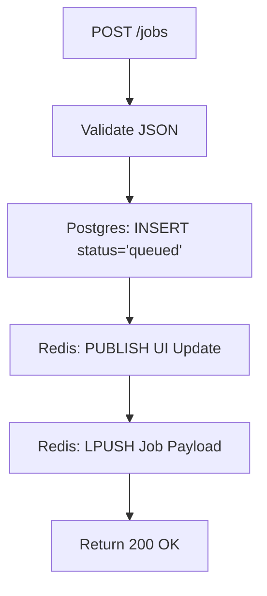

# 3. Detailed Codebase Breakdown

This document provides a line-by-line, function-by-function breakdown of the exact code you wrote in your repository. When an interviewer asks to do a screen share or asks exactly how a specific file operates, this is your map.

---

## 1. `backend/app.js` (The Producer & API Gateway)

### 1.1 Architectural Responsibility
`app.js` acts purely as an API gateway. Its sole responsibilities are validating incoming user requests, interacting securely with the database via connection pooling, pushing jobs into Redis, and serving WebSockets. It *never* processes a job.

### 1.2 Function Breakdown

*   `app.post('/jobs')`: The core Producer function. 
    1. Validates `type` and `priority` against the enums exported from `queues.js`.
    2. Generates a random UUID.
    3. Executes `pool.query('INSERT INTO jobs (id, type, payload, status, priority) ...')`.
    4. **Crucial Pattern:** Executes `redis.publish('job_updates')` *before* it pushes to the queue. This prevents a race condition where the worker finishes the job faster than the API can tell the UI it started.
    5. Executes `redis.lPush(queueKey, payload)`.
*   `app.get('/jobs')`: Powers the React dashboard feed. Uses `ORDER BY CASE WHEN status = 'processing' THEN 1 ELSE 2 END ASC` to ensure jobs currently being processed stick to the top of the UI list.
*   `app.get('/stats')`: Powers the dashboard metrics (Queued, Failed, Avg Time). Instead of running 5 separate SQL queries, it brilliantly uses PostgreSQL's aggregate `FILTER` syntax (e.g., `COUNT(*) FILTER (WHERE status = 'queued')`) to calculate all metrics in a single, high-performance database round-trip.
*   `app.post('/jobs/:id/retry')`: Used by the DLQ dashboard. Simply resets a failed job's `status` to `queued` in Postgres and pushes it back into Redis.

### 1.3 `app.js` Flow Diagram


---

## 2. `backend/worker.js` (The Consumer & Engine)

### 2.1 Architectural Responsibility
`worker.js` is a completely separate Node.js process (or Docker container). It acts as the Consumer. It pulls jobs off Redis, guarantees atomic locking, executes the heavy lifting, handles failures (DLQ/Backoff), and runs self-healing maintenance loops.

### 2.2 Function Breakdown

*   `runWorkerLoop()`: The heartbeat of the consumer. It is an infinite `while(true)` loop. It executes the maintenance sweeps every 15 seconds. It heavily relies on `redisBlocker.brPop(QUEUES, BRPOP_TIMEOUT_SECONDS)` (which defaults to 5 seconds) to suspend the loop and wait for jobs with 0 CPU waste.
*   `handleJob(rawData, redis)`: The orchestrator.
    1. It generates a `processingToken` (UUID).
    2. Executes the Atomic Claim: `UPDATE jobs SET status = 'processing'... RETURNING *`.
    3. If the row returns, it passes it to `processJob()`.
    4. Wraps `processJob()` in a `try/catch`. 
    5. On success, updates Postgres to `completed`.
    6. On error (the `catch` block), it checks `max_retries`. If under the limit, it calls `scheduleRetry()`. Otherwise, it updates Postgres to `failed`.
*   `processJob(job)`: The actual execution function. In your simulated code, this calls `sleep(JOB_PROCESSING_MS)` and randomly throws an error based on `JOB_FAILURE_RATE` to simulate network unreliability. In a real app, this is where you call OpenAI or SendGrid.
*   `promoteDueRetries(redis)`: Runs on *every single worker iteration*. It queries the Redis ZSET using `ZRANGEBYSCORE DELAYED_QUEUE 0 Date.now()`. If it finds jobs whose timestamps are in the past, it removes them from the ZSET and pushes them back into the active lists.
*   `recoverStalledProcessingJobs(redis)`: The Reaper. Runs every 15 seconds. Looks for jobs in Postgres stuck in `processing` for more than 60 seconds (implying the worker died). Resets them to `queued` and re-pushes to Redis.
*   `recoverMissingQueuedJobs(redis)`: The Cache-Wipe Protector. Runs every 15 seconds. If Redis crashes and wipes its RAM, this compares all `queued` jobs in Postgres against what's actually inside Redis. Any missing jobs are re-pushed.

### 2.3 `worker.js` Flow Diagram
```mermaid
flowchart TD
    Loop[while(true)] --> Maint{Time for Maintenance?}
    Maint -- Yes --> R1[recoverStalled] & R2[recoverMissing]
    Maint -- No --> Pop[BRPOP (Blocks 5s)]
    Pop --> Claim[Atomic UPDATE RETURNING]
    Claim -- Success --> Exec[processJob()]
    Exec -- Catch Error --> Math[Calc Backoff]
    Math --> ZSET[ZADD Delayed Queue]
    Exec -- Success --> Done[Update to Completed]
```

---

## 3. `backend/redis.js` (The Cache Manager)

### 3.1 Architectural Responsibility
To establish connections to Redis and export them for use.

### 3.2 Core Mechanisms
*   **Duplicate Clients:** The `BRPOP` and `SUBSCRIBE` commands are blocking. If you execute `BRPOP` on a Redis client, that client is locked. You cannot use it to `ZADD` or `PUBLISH`. `redis.js` exports a `createRedisClient` factory function.
*   `app.js` creates one client for `LPUSH` and a duplicate for `SUBSCRIBE`.
*   `worker.js` creates a `redisBlocker` client specifically for `BRPOP`, and a `redisCommands` client for updating the ZSET and publishing state changes.

---

## 4. `backend/db.js` (The Database Driver)

### 3.1 Architectural Responsibility
To manage connections to the PostgreSQL database.

### 3.2 Core Mechanisms
*   **Connection Pooling:** Instead of establishing a new TCP connection for every single HTTP request (which takes massive overhead), it exports a `pg.Pool`. The Express routes transparently borrow an open connection from this pool, execute the query, and return it.

---

## 5. `backend/queues.js` (The Nervous System)

### 5.1 Architectural Responsibility
To serve as the shared central source of truth for queue names, priorities, and validation enums. By importing this file, both `app.js` and `worker.js` agree on the strict spelling of Redis keys without needing to import each other (which would create circular dependencies).

### 5.2 Core Mechanisms
*   **`QUEUES_IN_PRIORITY_ORDER`:** This array (`['jobQueue:high', 'jobQueue', 'jobQueue:low']`) natively dictates priority queuing. When passed directly into `BRPOP` by the worker, Redis strictly evaluates the array from left to right, guaranteeing high-priority jobs are always drained first.
