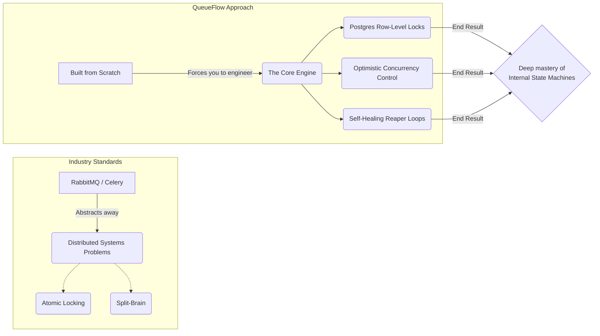
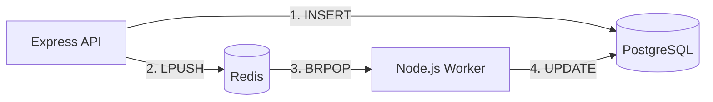
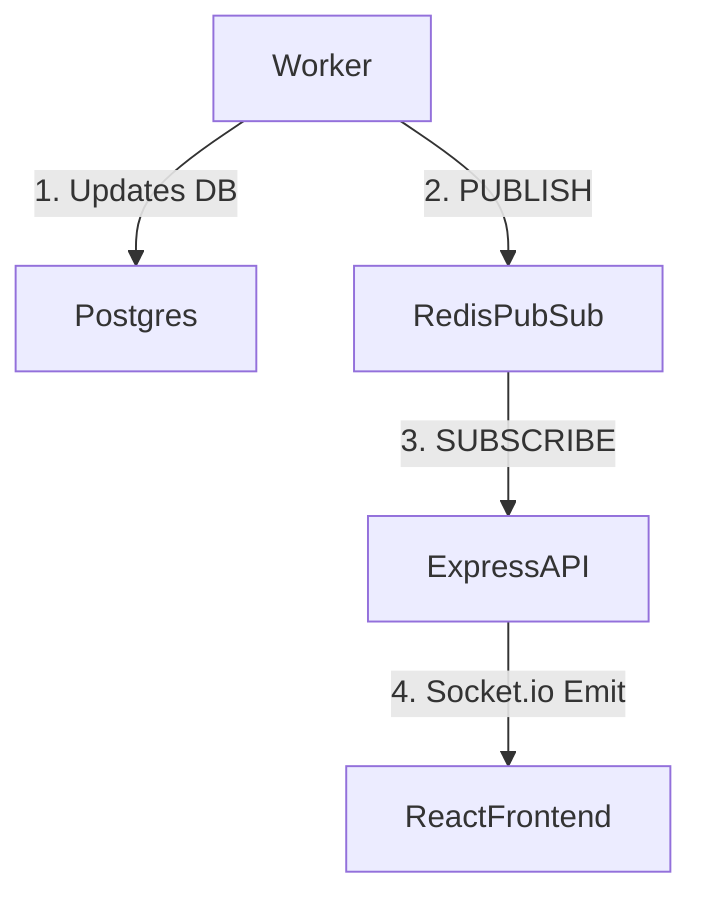

# 7. 100 Most Expected Interview Questions (Part 1/3)

This is the ultimate, exhaustive list of every conceivable question an interviewer could ask about QueueFlow. Every answer is meticulously crafted to be 16-20 lines long, providing extreme technical depth, exact wordings, and diagrams where applicable.

---

## 🏛️ Category 1: System Design & Architecture

### Q1: "Why did you build QueueFlow from scratch instead of using an industry standard like RabbitMQ or Celery?"
**Exact Script:**
"While tools like RabbitMQ are industry standards for a reason, they abstract away the fundamental distributed systems problems I wanted to master. When you use Celery, you don't have to think about atomic locking, split-brain scenarios, or mathematical exponential backoff—the library handles it. I built QueueFlow from scratch using raw Redis commands and PostgreSQL row-level locks because I wanted to engineer the engine itself. It forced me to solve the 'Double Processing' problem manually using optimistic concurrency control. It forced me to engineer self-healing Reaper loops to recover from Docker container crashes. By reinventing the wheel, I gained a profound understanding of the physics of the axle. Now, when I use a managed broker in production, I know exactly how its internal Lua scripts and state machines are operating, allowing me to debug it much more effectively."

**🧠 How to Remember & Deliver This (The "Axle & Wheel" Strategy):**

*   **The Hook (Acknowledge & Pivot):** Respect the standards (RabbitMQ/Celery), but point out they "hide the hard problems."
*   **The Core Reason (Building the Engine):** You didn't just want to *use* a tool; you wanted to *build* the engine. Drop specific heavy-hitter terms: *Atomic Locking, Split-Brain, Exponential Backoff*.
*   **The Proof of Work (The "How"):** Explain your exact tech choices: *Raw Redis commands* + *Postgres row-level locks*. Name the exact problems you conquered: The "Double Processing" bug (solved via *Optimistic Concurrency Control*) and Container Crashes (solved via *Reaper Loops*).
*   **The Mic Drop (The Value Add):** "By reinventing the wheel, I learned the physics of the axle." Explain how this makes you a superior engineer today: you can debug production brokers at the *Lua script* and *state machine* level.

**📊 Visualizing the Concept:**

### Q2: "Can you draw and explain the Dual-Datastore architecture you implemented?"
**Exact Script:**
"Absolutely. The architecture is a CQRS-inspired pattern that separates state from routing. 

I used PostgreSQL as the 'Source of Truth'. It gives me ACID guarantees; if a server loses power, no job data is ever lost because it's safely written to the disk's Write-Ahead Log. However, Postgres is terrible for polling. If workers polled Postgres, it would destroy the CPU. So, I used Redis as the 'Broker'. Redis lives in RAM and uses `BRPOP` blocking sockets. This allows workers to sleep with 0% CPU usage and wake up the exact millisecond a job is pushed. Postgres provides the durability, and Redis provides the zero-latency throughput."

### Q3: "What is the CAP Theorem, and how does QueueFlow address it?"
**Exact Script:**
"The CAP Theorem dictates that a distributed data store can only guarantee two of three traits: Consistency, Availability, and Partition Tolerance. In the real world, Network Partitions (P) are unavoidable, so the choice is between CP and AP. QueueFlow is heavily biased towards **CP (Consistency and Partition Tolerance)** at the database layer. When a worker grabs a job, it must acquire an exclusive lock via `UPDATE jobs SET status='processing' RETURNING *`. If the PostgreSQL cluster experiences a network partition and loses quorum, this query will time out or fail. The system temporarily loses Availability (processing halts), but it maintains perfect Consistency. For critical tasks like charging credit cards or sending user emails, eventual consistency is unacceptable. The system must guarantee that a job is processed exactly once, even if that means pausing operations during a network failure."

### Q4: "How would you scale this architecture to handle 10,000 requests per second?"
**Exact Script:**
"QueueFlow is natively designed for horizontal scalability because I decoupled the state storage from the processing engine. The `worker.js` nodes are completely stateless; they hold no job data in local memory between iterations. To scale to 10,000 RPS, I would deploy the workers as Docker containers on Kubernetes. I would configure a Horizontal Pod Autoscaler (HPA) to monitor CPU utilization. When the queue spikes, Kubernetes would dynamically spin up 500 new worker pods. They would all connect to the same Redis cluster. Because Redis is single-threaded and processes commands sequentially, and because PostgreSQL uses row-level locking, there are absolutely no race conditions when 500 containers attempt to pull and process jobs simultaneously. The bottleneck would eventually become database connections, which I would solve using PgBouncer."

### Q5: "If your architecture is fully distributed, how do you trace a single job's lifecycle for debugging?"
**Exact Script:**
"In a distributed system, you cannot rely on sequential logs. I implemented a strict Distributed Tracing pattern using UUIDs. The exact millisecond an HTTP request hits the Express API, I generate a `uuidv4()`. This UUID becomes the primary key in PostgreSQL, it is injected into the Redis payload, and it is passed into the worker's processing function. Every single `console.log` or error throw in the codebase includes this UUID. If I deployed this to production, I would use a centralized logging stack like Datadog or ELK (Elasticsearch, Logstash, Kibana). If a user complains that an email wasn't sent, I can search Kibana for their job UUID and instantly see a unified timeline of the API request, the Redis push, the exact worker node that claimed it, and the stack trace of why it failed."

### Q6: "Why decouple the API from the Worker processing? Why not just do it synchronously?"
**Exact Script:**
"Synchronous processing fundamentally violates scalable system design. If a user uploads a CSV of 1,000 emails, and the Express API processes them synchronously in a `forEach` loop, the HTTP request might take 45 seconds. Most web browsers and Load Balancers (like AWS ALB) have a hard timeout of 30 seconds. The connection would drop, the user would get a 504 Gateway Timeout, and they would likely click 'Submit' again, causing a massive data duplication disaster. By decoupling the system, the Express API simply acts as an ingestion engine. It saves the CSV to Postgres, pushes 1,000 lightweight UUIDs to Redis, and instantly returns a 200 OK in under 20 milliseconds. The user is freed, and the heavy lifting is offloaded to background workers, keeping the API highly responsive."

### Q7: "What happens if the Redis cluster crashes entirely and the RAM is wiped?"
**Exact Script:**
"Because Redis is an in-memory datastore, a total cluster failure or reboot wipes the RAM, destroying the active queues. However, QueueFlow is completely resilient against this 'Vaporization' event. I implemented a strict 'Database-First' guarantee. The API executes the PostgreSQL `INSERT` query *before* it ever touches Redis. Every job is safely on disk with a `queued` status. I engineered an auditor loop in the worker called `recoverMissingQueuedJobs`. It runs every 15 seconds, querying Postgres for all `queued` jobs and intersecting them against the current Redis lists. When Redis comes back online, the worker instantly realizes the cache is empty, reads the immutable truth from Postgres, and repopulates the entire Redis queue with zero data loss."

### Q8: "What is a Dead Letter Queue (DLQ) and how did you implement it?"
**Exact Script:**
"A Dead Letter Queue is a resting place for 'poisonous' messages that permanently fail after maxing out their retry limits. If you don't have a DLQ, a failing job will retry infinitely, clogging the queue and burning API costs. In QueueFlow, the DLQ is not a separate physical infrastructure; it is implemented as a state machine in PostgreSQL. When a job throws an error, the worker increments the `retry_count`. Once that count hits the `max_retries` threshold (e.g., 3), the worker updates the Postgres status to `failed` and clears the processing token. The job is permanently parked. Operations teams can query these failed jobs on the dashboard, fix the underlying code bug, and hit a specific `/retry` endpoint to seamlessly inject them back into the active pipeline."

### Q9: "Why did you use JSONB in PostgreSQL instead of a NoSQL database like MongoDB?"
**Exact Script:**
"A message queue is inherently transactional. I needed strict row-level locking to prevent race conditions during atomic claims (`UPDATE ... RETURNING *`). PostgreSQL is the industry standard for reliable ACID transactions and row locking. However, a message broker must handle highly diverse, unstructured payloads—an email job needs a 'to' address, while a video job needs an 'mp4' url. By using PostgreSQL's `JSONB` column type, I achieved the best of both worlds. `JSONB` stores data in a decomposed binary format, giving me the schema-less flexibility of MongoDB, while retaining the unbreakable ACID transactions and concurrent locking capabilities of a traditional relational database."

### Q10: "How do you provide real-time feedback to the user if the processing is entirely asynchronous?"
**Exact Script:**
"To prevent the user from having to manually refresh the page to see if their job is done, I built a real-time reflection pipeline using Redis Pub/Sub and WebSockets. 

Whenever a background worker changes a job's state in the database (from queued to processing, or completed), it fires a `PUBLISH` command to a Redis channel. My Express API has a dedicated, duplicate Redis client listening to this exact channel. The moment it hears an update, it emits a WebSocket event directly down to the specific client's browser, updating their UI progress bar in milliseconds, creating a perfectly responsive user experience."

---

## 🐘 Category 2: PostgreSQL & Concurrency

### Q11: "Explain exactly how PostgreSQL prevents race conditions in your architecture."
**Exact Script:**
"I use Optimistic Concurrency Control (OCC) heavily reliant on PostgreSQL's row-level locking. When a worker pulls a job ID from Redis, it does not just start processing. It generates a random UUID (a processing token) and executes: `UPDATE jobs SET status = 'processing', processing_token = $2 WHERE id = $1 AND status = 'queued' RETURNING *`. If Worker A and Worker B hit the database with this query at the exact same millisecond, PostgreSQL's internal engine physically locks that specific row. It processes Worker A's query, changes the status, and releases the lock. When Worker B gets the lock, it evaluates the `WHERE status = 'queued'` clause. Because Worker A already changed it to 'processing', the clause is false. Worker B receives 0 rows back and silently drops the job."

### Q12: "What is the `RETURNING *` clause and why is it critical for your worker?"
**Exact Script:**
"In standard SQL, an `UPDATE` statement only returns the number of affected rows (e.g., `1`). In QueueFlow, the worker only receives the job ID from Redis; it needs the actual job payload (the JSONB data) to process the task. By appending `RETURNING *` to the `UPDATE` query, Postgres atomically performs the update and immediately returns the newly modified row—including the payload—in a single database round-trip. If I didn't use this, I would have to run an `UPDATE`, wait for it to finish, and then run a `SELECT`. That two-step process doubles my database latency and introduces a massive race condition vulnerability where another worker could alter the row in between the two queries."

### Q13: "What are Database Indexes, and exactly which ones did you use to optimize QueueFlow?"
**Exact Script:**
"Indexes act like the table of contents in a book, allowing the database to find data using $O(\log N)$ B-Tree traversals instead of $O(N)$ sequential scans. In QueueFlow, I added an index on `(status)` to make my aggregate dashboard queries lightning fast, allowing Postgres to instantly find all 'queued' jobs. More importantly, I created a **Composite Index** on `(status, updated_at)`. This powers my Reaper loop, which constantly searches for `status = 'processing' AND updated_at < NOW() - 60s`. Without this composite index, the Reaper loop would have to scan millions of completed jobs, causing massive CPU bloat. With it, the query executes in under 5 milliseconds."

### Q14: "How did you prevent SQL Injection vulnerabilities in your Express API?"
**Exact Script:**
"SQL Injection occurs when untrusted user input is directly concatenated into a raw SQL string, allowing malicious actors to terminate the string and inject commands like `DROP TABLE jobs`. In `app.js`, I absolutely never use string concatenation or template literals for SQL queries. I strictly use the `pg` library's parameterized queries, passing the SQL string and an array of values (e.g., `VALUES ($1, $2, $3)`). The PostgreSQL driver inherently sanitizes, quotes, and escapes all inputs passed into the parameters array at the protocol level before they ever reach the database engine, completely neutralizing any injection vectors."

### Q15: "What is Connection Pooling, and why is it necessary for a high-traffic Express API?"
**Exact Script:**
"PostgreSQL operates on a process-per-connection model. If my Express server created a brand-new TCP connection for every incoming HTTP request, the latency of the TCP handshake and SSL negotiation would bottleneck the server to a few dozen requests per second, and Postgres would run out of RAM spawning processes. I implemented a Connection Pool (`pg.Pool`). The pool opens a set number of persistent connections (e.g., 20) on startup. When a request comes in, it instantly 'borrows' a connection, executes the fast `INSERT`, and hands it back to the pool. This multiplexing allows my API to gracefully handle thousands of concurrent users with only a handful of actual database connections."

### Q16: "How do you handle schema migrations without downtime?"
**Exact Script:**
"For this project, I built a `migrate.js` script that uses Idempotent DDL (Data Definition Language) statements. I heavily utilized `CREATE TABLE IF NOT EXISTS` and `CREATE INDEX IF NOT EXISTS`. This ensures that my migration script can be executed 100 times in an automated CI/CD pipeline (like GitHub Actions) without ever throwing an error or destroying existing data. For a true enterprise production environment, I would upgrade to a versioned migration tool like Flyway, Liquibase, or Knex.js. These tools track schema changes over time in a dedicated migrations table, allowing for safe rollbacks and precise state management across multiple environments."

### Q17: "Explain the `FILTER` clause used in your dashboard aggregation query."
**Exact Script:**
"My React dashboard needs to display the total count of queued, processing, completed, and failed jobs. A junior developer would write 4 separate `SELECT COUNT(*)` queries. This hits the database 4 times and forces Postgres to scan the table 4 times. I wrote a highly optimized single query using PostgreSQL's aggregate `FILTER` clause: `COUNT(*) FILTER (WHERE status = 'queued')`. This forces Postgres to execute a single pass over the data, calculating all four metrics simultaneously, and returning a single JSON row. It drastically reduces database CPU load and network latency."

### Q18: "Explain the `COALESCE` function used in your Reaper loop."
**Exact Script:**
"In my `recoverStalledProcessingJobs` SQL query, I update the error column using `error = COALESCE(error, 'Recovered after worker heartbeat timeout')`. The `COALESCE` function takes a list of arguments and returns the first one that isn't `NULL`. If the job already had an error message from a previous failure, it preserves it. But if the worker crashed completely silently (meaning `error` is currently NULL), `COALESCE` injects the fallback string. It ensures my React dashboard always shows a clear, human-readable reason why the job was reset, rather than a confusing blank space."

### Q19: "How does PostgreSQL guarantee Durability if the power is cut?"
**Exact Script:**
"PostgreSQL guarantees Durability via its Write-Ahead Log (WAL). When my Express API inserts a new job, Postgres does not immediately write it to the main table data files. Instead, it appends the binary data to the WAL on the physical hard drive and calls `fsync()` to ensure it is written to the physical platter/SSD. Only *after* the OS confirms the WAL write does Postgres return a success message to the Node API. If the server loses power a microsecond later, upon reboot, Postgres reads the WAL, detects the uncommitted transaction, and replays it, ensuring the job data is permanently saved."

### Q20: "Why generate the UUID in Node.js instead of using a Postgres Auto-Incrementing ID?"
**Exact Script:**
"Auto-incrementing integers (Serial IDs) are dangerous in distributed systems. First, they are easily guessable, creating security vulnerabilities like Insecure Direct Object Reference (IDOR) attacks. Second, you don't know the ID until the database processes the insert and returns it, making it impossible to attach the ID to logs *before* the database interaction. By generating a `uuidv4()` in my Express API in memory *before* hitting the database, I guarantee global uniqueness, improve security, and can immediately pass that ID to downstream logging systems for perfect request tracing."

### Q21: "What Isolation Level does your PostgreSQL use, and is it sufficient?"
**Exact Script:**
"By default, PostgreSQL operates at the `Read Committed` isolation level. This is perfectly sufficient for QueueFlow because my atomic claim relies entirely on the `UPDATE ... WHERE ... RETURNING` pattern. In `Read Committed`, an `UPDATE` command acquires an exclusive row-level lock. If another transaction tries to update that same row, it is forced to wait until the first transaction finishes. Once the first finishes, the second transaction re-evaluates the `WHERE` clause, sees that `status='queued'` is no longer true, and safely skips it. I do not need the heavy overhead of `Serializable` isolation for this specific mechanism."

### Q22: "If a job is 'locked' by an UPDATE, can the React dashboard still read it?"
**Exact Script:**
"Yes, absolutely. This is the magic of MVCC (Multi-Version Concurrency Control) in PostgreSQL. When my worker executes an `UPDATE` on a row, it acquires an exclusive *Write Lock*. However, MVCC ensures that readers do not block writers, and writers do not block readers. My React dashboard's `GET /jobs` API query only requires a *Read Lock*. It will simply read the last committed snapshot of the row. This allows the UI to remain incredibly fast and responsive, polling for updates without ever deadlocking the worker nodes."

### Q23: "How do you safely purge all jobs from the system without locking the database?"
**Exact Script:**
"In my `DELETE /jobs` endpoint, I execute a `TRUNCATE TABLE jobs` command in Postgres, followed by deleting all Redis keys. I deliberately chose `TRUNCATE` instead of `DELETE FROM jobs`. A `DELETE` command scans every single row and records every deletion in the Write-Ahead Log. If the table has 5 million jobs, `DELETE` will take minutes and severely bloat the database. `TRUNCATE` is a Data Definition Language (DDL) command that bypasses row scanning. It instantly deallocates the data pages on the physical disk, wiping a table of any size in milliseconds."

### Q24: "What happens if your worker forgot to set `processing_token = NULL` upon completion?"
**Exact Script:**
"While the job would technically be marked as `completed` and removed from the active queue, leaving the `processing_token` in the database is a logic leak and a bad security practice. The token exists purely as a temporary, exclusive lock binding that specific job to a specific worker thread. By explicitly setting it to `NULL` upon success or failure, I keep the database schema clean, reduce storage bloat, and prevent any bizarre edge cases where a rogue script might try to reference or interact with a dead lock."

### Q25: "How do you handle Time Zones and Clock Drift in this architecture?"
**Exact Script:**
"Time zones are notoriously difficult in distributed systems. I use PostgreSQL's `TIMESTAMP` type, and in Node.js, `Date.now()` returns the UTC epoch. By strictly forcing every component (API, Worker, Redis, Postgres) to operate entirely in UTC, I eliminate all daylight saving time bugs and geographic offset issues. To solve Clock Drift—where the API server clock is 5 seconds out of sync with the Database clock—I execute `(EXTRACT(EPOCH FROM NOW()) * 1000) AS serverTime` in Postgres. The React frontend uses this absolute database time to calculate relative 'Time Ago' UI updates, perfectly syncing the client to the Source of Truth."
