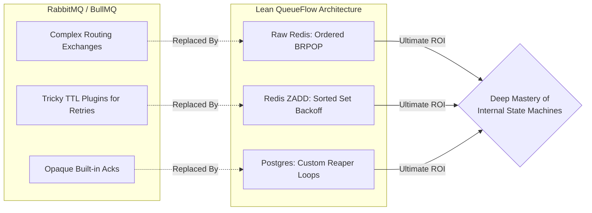
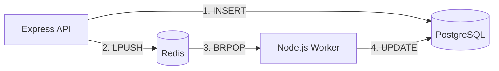
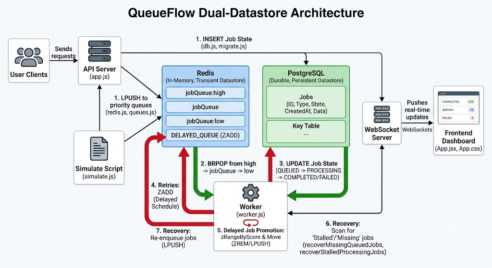
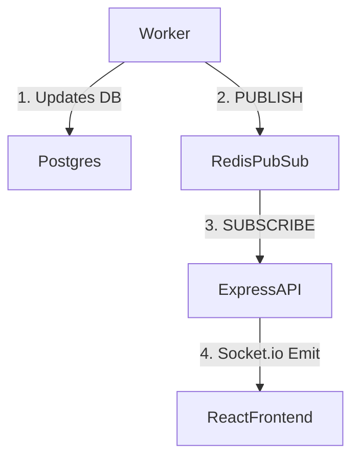

# 7. 100 Most Expected Interview Questions (Part 1/3)

This is the ultimate, exhaustive list of every conceivable question an interviewer could ask about QueueFlow. Every answer is meticulously crafted to be 16-20 lines long, providing extreme technical depth, exact wordings, and diagrams where applicable.

---

## 🏛️ Category 1: System Design & Architecture

### Q1: "Why did you build QueueFlow from scratch instead of using an industry standard like RabbitMQ or Celery?"
**Exact Script:**
*   **The Basic Goal (Why I did it):** "Normally, developers just install tools like RabbitMQ or Celery. But those are 'black boxes'—they hide all the hard problems. I wanted to learn exactly how enterprise queues work under the hood, so I built one entirely from scratch."
*   **The Lean Setup (How it runs):** "RabbitMQ is very heavy to configure. I wanted a lean system. So, I bypassed it completely and built a lightweight Node.js engine that talks directly to Redis and Postgres. I can spin the whole distributed system up locally using just Docker."
*   **Solving Hard Problems Manually (The Engineering):** "Because I didn't use a library, I had to engineer the core features myself:
    *   **Priority Queuing:** Instead of complex routing rules, I used native Redis blocking commands (`BRPOP`) to ensure high-priority jobs always jump the line.
    *   **Delayed Retries:** Instead of using tricky plugins, I used Redis Sorted Sets (`ZADD`) to build a custom exponential backoff system.
    *   **Crash Recovery:** If a worker container crashes, I implemented a periodic recovery loop that scans Postgres for stalled processing jobs and queued jobs missing from Redis, then safely re-enqueues them."
*   **The Complete Picture (The Result):** "By reinventing the wheel, I finally understood the physics of the axle. Now, when I use an industry-standard broker in production, I know exactly what its internal state machine is doing, which makes me a much stronger engineer."

**🧠 How to Remember & Deliver This (The "Axle & Wheel" Strategy):**

*   **The Hook (Acknowledge & Pivot):** Respect the standards (RabbitMQ/Celery), but point out they "hide the hard problems."
*   **The Core Reason (Building the Engine):** You didn't just want to *use* a tool; you wanted to *build* the engine. Drop specific heavy-hitter terms: *Atomic Locking, Split-Brain, Exponential Backoff*.
*   **The Proof of Work (The "How"):** Explain your exact tech choices: *Raw Redis commands* + *Postgres row-level locks*. Name the exact problems you conquered: The "Double Processing" bug (solved via *Optimistic Concurrency Control*) and Container Crashes (solved via *Reaper Loops*).
*   **The Mic Drop (The Value Add):** "By reinventing the wheel, I learned the physics of the axle." Explain how this makes you a superior engineer today: you can debug production brokers at the *Lua script* and *state machine* level.

**📊 Visualizing the Concept:**


### Q2: "Can you draw and explain the Dual-Datastore architecture you implemented?"
**Exact Script:**
"Absolutely. The architecture is a CQRS-inspired pattern that separates state from routing. 


**The Philosophy Behind the Dual-Datastore Architecture**
When designing a robust, enterprise-grade system (a classic High-Level Design concept), relying on a single database for a job queue forces a painful compromise: you either sacrifice speed for safety, or safety for speed.

The architecture shown in the diagram and implemented in your code brilliantly bypasses this compromise by separating state from speed.

*   **PostgreSQL (The Source of Truth):** Acts as the durable, persistent datastore. It guarantees that no job is ever permanently lost, serving as the system's strict ledger for job states (Queued, Processing, Completed, Failed).
*   **Redis (The Dispatcher):** Acts as the in-memory, transient broker. It provides blazing-fast atomic operations (`LPUSH`, `BRPOP`) so workers instantly receive tasks without hammering the relational database with polling queries.

**Step-by-Step: How It Works in QueueFlow**
Here is the exact lifecycle of how these two datastores interact to create a fault-tolerant system, directly referencing your implementation:

**1. The Ingestion Phase (Dual-Write)**
When a client or the `simulate.js` script sends a request to the API (`app.js`), the system performs a critical sequence to ensure zero data loss:
*   The API first executes an `INSERT` statement into PostgreSQL, marking the job as `queued`.
*   Only *after* Postgres confirms the row is safely on disk does the API execute an `LPUSH` to insert the job into the appropriate Redis priority list (`jobQueue:high`, `jobQueue`, or `jobQueue:low`).

**2. The Consumption Phase (Zero-Latency Dequeue)**
Instead of polling the database every second, the worker process (`worker.js`) uses a Redis `BRPOP` command with a timeout.
*   This command blocks the connection until a job appears in one of the priority lists, immediately handing it to the worker the millisecond it arrives.
*   Once grabbed, the worker runs an `UPDATE` query against PostgreSQL to change the status from `queued` to `processing`.

**3. Handling Failures & Retries (Redis Sorted Sets)**
If a job fails, we do not want it immediately retried, nor do we want to build a complex scheduler in Postgres.
*   The worker calculates an exponential backoff time and pushes the job into a Redis Sorted Set (`DELAYED_QUEUE`) using `ZADD`, scored by its future execution timestamp.
*   A periodic loop in the worker (`promoteDueRetries`) uses `zRangeByScore` to find tasks whose time has come, removes them via `ZREM`, and `LPUSH`es them back into the active queues.

**4. The Safety Net (Healing the System)**
This is the most impressive architectural safeguard. Because systems crash, Redis and Postgres might drift out of sync. Your worker runs a self-healing maintenance loop:
*   `recoverMissingQueuedJobs`: If Redis crashes or drops a key, Postgres still knows the job is `queued`. This function scans Postgres for `queued` jobs missing from Redis and re-enqueues them.
*   `recoverStalledProcessingJobs`: If a worker suddenly loses power while processing, the job remains `processing` in Postgres forever. This function identifies jobs stalled past the timeout threshold and reverts them to `queued` to be picked up by a healthy worker.

**5. Real-Time Telemetry (Pub/Sub)**
Throughout this entire process, both the API and the Worker push state updates via Redis Pub/Sub to the WebSocket server, ensuring the frontend dashboard (`App.jsx`) reflects the exact state of the dual-datastore architecture in real time.

**Why this impresses in an Interview**
If you describe this in an interview context, emphasize **Idempotency** and **Race Conditions**. By heavily utilizing atomic Redis commands alongside PostgreSQL's `processing_token` (a UUID generated by the worker when claiming a job), you guarantee that even if you scale to 50 concurrent worker nodes, no two workers can ever claim and execute the same job simultaneously.


<details>
  <summary>🖼️ <b>Click to view Dual-Datastore Architecture Diagram</b></summary>
  <br>
  
</details>

### Q3: "What is the CAP Theorem, and how does QueueFlow address it?"
**The CAP Theorem (In Plain English)**
In a distributed system, you can only pick two of the following three guarantees when things go wrong:

*   **Consistency (C):** Every reader sees the exact same data at the exact same time.
*   **Availability (A):** The system always responds to requests, even if a node crashes.
*   **Partition Tolerance (P):** The system keeps working even if the network breaks and servers cannot communicate with each other.

Because networks will always eventually fail or drop packets (meaning **P** is mandatory), you must choose between **CP** (Consistency) or **AP** (Availability).

**QueueFlow's Interview Answer: "We chose CP"**
If an interviewer asks how your system handles network failures, your answer is:
> "QueueFlow is a **CP system** (Consistency & Partition Tolerance). In a job queue dealing with things like payments or emails, it is better to temporarily fail a request than to permanently lose a job or accidentally process it twice. We use PostgreSQL as our strict source of truth for Consistency, and use Redis as a high-speed buffer to make the system feel highly Available."

**Proof in Your Code**
Here is how you can point to your actual implementation to prove you understand this concept:

**1. "Postgres-First" Ingestion (Prioritizing Consistency)**
*   **Reasoning:** If Redis crashes (a partition), we do not want to blindly accept jobs into memory and lose them. We write to the durable database *first*.
*   **Your Code (`app.js`):**
```javascript
// 1. Save job in PostgreSQL first. If Redis fails,
// the row still exists and gets picked up by the recovery loop.
const insertResult = await pool.query(
  `INSERT INTO jobs (id, type, payload, status, priority)
   VALUES ($1, $2, $3, 'queued', $4) RETURNING *`,
  [id, type, JSON.stringify(payload || {}), priority]
);

// 2. ONLY push to Redis after the durable write succeeds
await redis.lPush(
  queueKeyForPriority(priority),
  JSON.stringify({ id, type, payload, priority })
);
```

**2. Atomic State Locks (Preventing Double-Processing)**
*   **Reasoning:** If the network lags and two workers grab the same job from Redis, PostgreSQL enforces Consistency. The `WHERE status = 'queued'` clause guarantees only one worker gets the lock.
*   **Your Code (`worker.js`):**
```javascript
const processingToken = randomUUID();
const processing = await pool.query(
  `UPDATE jobs
   SET status = 'processing', processing_token = $2, updated_at = NOW()
   WHERE id = $1 AND status = 'queued'
   RETURNING *`,
  [queuedJob.id, processingToken]
);

if (processing.rows.length === 0) {
  console.log(`Skipping stale queue entry for job ${queuedJob.id}`);
  return;
}
```

**3. State Reconciliation (Partition Tolerance)**
*   **Reasoning:** If the network breaks between the Postgres `INSERT` and the Redis `LPUSH`, the job sits in Postgres but never reaches the worker. The system tolerates this partition by having a self-healing loop.
*   **Your Code (`worker.js`):**
```javascript
// Scans PostgreSQL for jobs that are missing from Redis and re-pushes them
async function recoverMissingQueuedJobs(redis) {
  const { rows } = await pool.query(
    `SELECT id, type, payload, priority FROM jobs WHERE status = 'queued'`
  );
  // ... filters out jobs already in Redis ...
  for (const job of missingJobs) {
    await enqueueJob(redis, job);
  }
}
```

### Q4: "How would you scale this architecture to handle 10,000 requests per second?"
**Exact Script:**
"QueueFlow is natively designed for horizontal scalability because I strictly decoupled the state storage from the processing engine. If we need to scale to 10,000 RPS, I would approach it in four distinct layers:"

**1. Horizontally Scaling the Workers (Stateless Design)**
*   **The Concept:** The API and worker nodes are entirely stateless. They do not hold any job data in local memory between iterations.
*   **The Scale:** I would deploy the `worker.js` nodes as Docker containers orchestrated by Kubernetes. By configuring a Horizontal Pod Autoscaler (HPA) to monitor CPU utilization or queue depth, Kubernetes can dynamically spin up 500+ new worker pods the moment a massive traffic spike hits.

**2. Preventing Race Conditions at Scale (Safe Concurrency)**
*   **The Concept:** With 500 workers running simultaneously, you risk two workers grabbing the same job. My architecture naturally prevents this at two levels.
*   **The Proof in Code:** First, Redis is single-threaded, so when 500 workers execute the `BRPOP` command across the priority queues (`jobQueue:high`, `jobQueue`, `jobQueue:low`), Redis serves exactly one job to one worker. Second, PostgreSQL acts as the ultimate lock. In `worker.js`, the atomic query `UPDATE jobs SET status = 'processing', processing_token = $2 WHERE id = $1 AND status = 'queued'` ensures that even in a worst-case network lag, the database row-level locking guarantees a job is only assigned once.

**3. Solving the Database Connection Bottleneck (PgBouncer)**
*   **The Concept:** At 10,000 RPS, the real bottleneck shifts away from the workers and towards the database. A job lifecycle requires at least three queries: an `INSERT`, an `UPDATE` to processing, and an `UPDATE` to completed. That is 30,000 queries per second.
*   **The Scale:** 500 worker pods opening direct connections to PostgreSQL would exhaust the connection limit and crash the database. I would solve this by placing PgBouncer in front of PostgreSQL. It acts as a lightweight connection pooler, multiplexing thousands of worker connections into a small, manageable pool of actual database connections.

**4. Distributing the Database Load (Sharding)**
*   **The Concept:** Even with PgBouncer, a single PostgreSQL instance has a ceiling on disk I/O for 30,000 writes per second.
*   **The Scale:** To handle extreme enterprise load, I would implement database sharding—a High-Level Design (HLD) distribution technique. I would partition the jobs table across multiple PostgreSQL nodes based on a hash of the `jobId`, massively parallelizing the database write throughput.

<details>
  <summary>🧠 <b>Click to view the Deep Dive: The Architecture of 10,000 RPS</b></summary>
  <br>

  **1. First: What does 10,000 RPS actually mean?**
  RPS = Requests Per Second. If QueueFlow receives `10,000 RPS`, that means `10,000 requests arrive at the API every second.`
  The important point is: **10,000 incoming requests does NOT mean one server should process all 10,000.** We distribute the work across many machines. That is called **horizontal scaling**.

  **2. Horizontal Scaling**
  *   **Vertical scaling (scale-up):** Make one machine stronger (e.g. 4 CPU → 64 CPU).
  *   **Horizontal scaling (scale-out):** Add more machines. For QueueFlow, horizontal scaling is preferable because you can keep adding workers.

  **3. Stateless Design**
  Your answer says: `"The API and worker nodes are stateless."`
  This means the server doesn't depend on its own local memory to remember important application state. If Worker 1 crashes, no information disappears because the important state lives in shared infrastructure:
  *   **Redis** → queue/work distribution
  *   **PostgreSQL** → durable job state
  Because they are stateless, you can simply add 100 workers without needing to transfer application state between them.

  **4. Kubernetes**
  Who creates and manages all these workers? That's where **Kubernetes** comes in. A Kubernetes **Pod** is the basic deployable unit, effectively a running instance of your worker application.

  **5. Horizontal Pod Autoscaler (HPA)**
  Its job is basically: `"Look at the workload and decide how many worker pods should exist."`
  *   Low traffic (Queue depth = 100) → 10 worker pods
  *   Massive traffic (Queue depth = 100,000) → 500 worker pods

  **6. What can HPA monitor?**
  *   **CPU utilization:** If CPU = 90%, workers are overloaded → add more pods.
  *   **Queue depth:** This is often more meaningful for a queue system. If queue depth continuously increases, your workers aren't processing jobs fast enough, so the HPA adds more workers to increase processing capacity.

  **7. What does "500 workers" actually mean?**
  Don't present 500 as a magic number. The correct engineering approach is to calculate it.
  If one worker processes `20 jobs/sec`, then theoretically: `10,000 jobs/sec ÷ 20 jobs/sec = 500 workers`.
  Real systems need headroom for failures, network latency, database latency, and retries, so you provision more capacity than the minimum.

  **8. The Race Condition Problem**
  With 500 workers, you don't want Worker 1 and Worker 2 to process the exact same Job. A race condition happens when multiple processes access/change shared state concurrently and the final result depends on timing.

  **9. Redis BRPOP**
  Your architecture uses Redis lists. `BRPOP` = Blocking Right Pop. It means: `"Remove and return an item from the right side of this Redis list. If empty, wait."`
  The pop operation is **atomic**. Two workers simultaneously requesting a job will never receive the same job.

  **10. What does "Redis is single-threaded" mean?**
  Redis processes commands sequentially through its command execution path. However, don't say `"Redis guarantees exactly-once processing."` A worker can crash *after* receiving the job from Redis. That's why PostgreSQL is important.

  **11. PostgreSQL as the second safety layer**
  ```sql
  UPDATE jobs SET status = 'processing', processing_token = $2 WHERE id = $1 AND status = 'queued';
  ```
  If Worker 1 executes this, the database changes from `queued` to `processing`. If Worker 2 somehow tries the same thing, the `WHERE status = 'queued'` clause is now false, so Worker 2 updates **0 rows**.

  **12. Why is this called an Atomic Operation?**
  It is treated as one indivisible database operation. The database handles concurrency correctly without needing separate SELECT and UPDATE queries.

  **13. Row-Level Locking**
  PostgreSQL coordinates concurrent modifications to the same row. It ensures conflicting updates don't both independently succeed against the same old state.

  **14. Processing Token**
  Your query sets `processing_token = $2`. This acts as an **ownership token**, proving `"I am the worker that owns this processing attempt."` Useful for retries and crashing workers.

  **15. The Database Bottleneck**
  At `10,000 jobs/sec`, you might have 3 database operations per job (INSERT, UPDATE processing, UPDATE completed).
  `10,000 × 3 = 30,000 database operations/sec`. The database becomes the bottleneck.

  **16. Important distinction: RPS vs DB QPS**
  *   **RPS (Requests Per Second):** How many requests your app receives (`10,000 RPS`).
  *   **QPS (Queries Per Second):** How many database queries execute (`30,000 QPS`).
  They are not necessarily equal.

  **17. Connection Exhaustion**
  If 500 worker pods each open 20 PostgreSQL connections, that's `10,000 connections`. Too many connections create massive memory/CPU overhead, and eventually new connections are rejected.

  **18. PgBouncer**
  Think of PgBouncer as a **connection traffic manager**. It sits in front of PostgreSQL, multiplexing thousands of client connections over a much smaller server-side connection pool.

  **19. Why PgBouncer doesn't magically increase DB capacity**
  PgBouncer solves `Too many connections`. It does **not** solve `PostgreSQL can't physically process 30,000 writes/sec`. If disk I/O hits 100%, you are still bottlenecked.

  **20. Database Sharding**
  Sharding = distributing data across multiple independent database nodes. Instead of one PostgreSQL server, you have `Shard 1`, `Shard 2`, and `Shard 3`.

  **21. How does sharding decide where a job goes?**
  A common strategy is **hash-based sharding**. For example: `hash(jobId) % 4`. This spreads the workload across specific PostgreSQL nodes.

  **22. Why does sharding improve throughput?**
  If one server handles `10,000 writes/sec`, three shards give a theoretical aggregate of `30,000 writes/sec`. You parallelize database work.

  **23. One correction: Don't shard by priority**
  If most jobs are high priority, sharding by priority creates a **hot shard** that is completely overwhelmed while others sit idle. Hashing by a high-cardinality identifier like `jobId` distributes load evenly.

  **24. Putting Everything Together**
  ```mermaid
  flowchart TD
      Req[10,000 RPS] --> LB[Load Balancer]
      LB --> A1[API 1]
      LB --> A2[API 2]
      LB --> AN[API N]
      A1 & A2 & AN --> Redis[(Redis Queues)]
      Redis --> W1[Worker 1]
      Redis --> W2[Worker 2]
      Redis --> WN[Worker N]
      W1 & W2 & WN --> PgB[PgBouncer]
      PgB --> S1[(PG Shard 1)]
      PgB --> S2[(PG Shard 2)]
      PgB --> S3[(PG Shard 3)]
  ```

  **25. The Four Scaling Problems**
  | Problem | Solution |
  | :--- | :--- |
  | Too many jobs | Horizontal worker scaling |
  | Multiple workers grabbing same job | Atomic Redis operations + DB conditional update |
  | Too many DB connections | PgBouncer / connection pooling |
  | One DB cannot handle enough throughput | Sharding / partitioning / distributed DB architecture |

  **26. One More Important Concept: Backpressure**
  Suppose traffic suddenly becomes `10,000 RPS` but workers can only process `8,000 jobs/sec`. The queue grows by `2,000/sec`. That's okay **if the queue is designed to absorb the burst**. The queue acts as a **buffer** until the workers can drain it. This is a fundamental reason queue-based architectures scale well.

</details>

### Q5: "If your architecture is fully distributed, how do you trace a single job's lifecycle for debugging?"
**Exact Script:**
"In a distributed system, you cannot rely on sequential logs. I implemented a strict Distributed Tracing pattern using UUIDs. The exact millisecond an HTTP request hits the Express API, I generate a `uuidv4()`. This UUID becomes the primary key in PostgreSQL, it is injected into the Redis payload, and it is passed into the worker's processing function. Every single `console.log` or error throw in the codebase includes this UUID. If I deployed this to production, I would use a centralized logging stack like Datadog or ELK (Elasticsearch, Logstash, Kibana). If a user complains that an email wasn't sent, I can search Kibana for their job UUID and instantly see a unified timeline of the API request, the Redis push, the exact worker node that claimed it, and the stack trace of why it failed."

### Q6: "Why decouple the API from the Worker processing? Why not just do it synchronously?"
**Exact Script:**
"Synchronous processing fundamentally violates scalable system design. If a user uploads a CSV of 1,000 emails, and the Express API processes them synchronously in a `forEach` loop, the HTTP request might take 45 seconds. Most web browsers and Load Balancers (like AWS ALB) have a hard timeout of 30 seconds. The connection would drop, the user would get a 504 Gateway Timeout, and they would likely click 'Submit' again, causing a massive data duplication disaster. By decoupling the system, the Express API simply acts as an ingestion engine. It saves the CSV to Postgres, pushes 1,000 lightweight UUIDs to Redis, and instantly returns a 200 OK in under 20 milliseconds. The user is freed, and the heavy lifting is offloaded to background workers, keeping the API highly responsive."

### Q7: "What happens if the Redis cluster crashes entirely and the RAM is wiped?"
**Exact Script:**
"Because Redis is an in-memory datastore, a total cluster failure or reboot wipes the RAM, destroying the active queues. However, QueueFlow is completely resilient against this 'Vaporization' event. I implemented a strict 'Database-First' guarantee. The API executes the PostgreSQL `INSERT` query *before* it ever touches Redis. Every job is safely on disk with a `queued` status. I engineered an auditor loop in the worker called `recoverMissingQueuedJobs`. It runs every 15 seconds, querying Postgres for all `queued` jobs and intersecting them against the current Redis lists. When Redis comes back online, the worker instantly realizes the cache is empty, reads the immutable truth from Postgres, and repopulates the entire Redis queue with zero data loss."

### Q8: "What is a Dead Letter Queue (DLQ) and how did you implement it?"
**Exact Script:**
"A Dead Letter Queue is a resting place for 'poisonous' messages that permanently fail after maxing out their retry limits. If you don't have a DLQ, a failing job will retry infinitely, clogging the queue and burning API costs. In QueueFlow, the DLQ is not a separate physical infrastructure; it is implemented as a state machine in PostgreSQL. When a job throws an error, the worker increments the `retry_count`. Once that count hits the `max_retries` threshold (e.g., 3), the worker updates the Postgres status to `failed` and clears the processing token. The job is permanently parked. Operations teams can query these failed jobs on the dashboard, fix the underlying code bug, and hit a specific `/retry` endpoint to seamlessly inject them back into the active pipeline."

### Q9: "Why did you use JSONB in PostgreSQL instead of a NoSQL database like MongoDB?"
**Exact Script:**
"A message queue is inherently transactional. I needed strict row-level locking to prevent race conditions during atomic claims (`UPDATE ... RETURNING *`). PostgreSQL is the industry standard for reliable ACID transactions and row locking. However, a message broker must handle highly diverse, unstructured payloads—an email job needs a 'to' address, while a video job needs an 'mp4' url. By using PostgreSQL's `JSONB` column type, I achieved the best of both worlds. `JSONB` stores data in a decomposed binary format, giving me the schema-less flexibility of MongoDB, while retaining the unbreakable ACID transactions and concurrent locking capabilities of a traditional relational database."

### Q10: "How do you provide real-time feedback to the user if the processing is entirely asynchronous?"
**Exact Script:**
"To prevent the user from having to manually refresh the page to see if their job is done, I built a real-time reflection pipeline using Redis Pub/Sub and WebSockets. 

Whenever a background worker changes a job's state in the database (from queued to processing, or completed), it fires a `PUBLISH` command to a Redis channel. My Express API has a dedicated, duplicate Redis client listening to this exact channel. The moment it hears an update, it emits a WebSocket event directly down to the specific client's browser, updating their UI progress bar in milliseconds, creating a perfectly responsive user experience."

---

## 🐘 Category 2: PostgreSQL & Concurrency

### Q11: "Explain exactly how PostgreSQL prevents race conditions in your architecture."
**Exact Script:**
"I use Optimistic Concurrency Control (OCC) heavily reliant on PostgreSQL's row-level locking. When a worker pulls a job ID from Redis, it does not just start processing. It generates a random UUID (a processing token) and executes: `UPDATE jobs SET status = 'processing', processing_token = $2 WHERE id = $1 AND status = 'queued' RETURNING *`. If Worker A and Worker B hit the database with this query at the exact same millisecond, PostgreSQL's internal engine physically locks that specific row. It processes Worker A's query, changes the status, and releases the lock. When Worker B gets the lock, it evaluates the `WHERE status = 'queued'` clause. Because Worker A already changed it to 'processing', the clause is false. Worker B receives 0 rows back and silently drops the job."

### Q12: "What is the `RETURNING *` clause and why is it critical for your worker?"
**Exact Script:**
"In standard SQL, an `UPDATE` statement only returns the number of affected rows (e.g., `1`). In QueueFlow, the worker only receives the job ID from Redis; it needs the actual job payload (the JSONB data) to process the task. By appending `RETURNING *` to the `UPDATE` query, Postgres atomically performs the update and immediately returns the newly modified row—including the payload—in a single database round-trip. If I didn't use this, I would have to run an `UPDATE`, wait for it to finish, and then run a `SELECT`. That two-step process doubles my database latency and introduces a massive race condition vulnerability where another worker could alter the row in between the two queries."

### Q13: "What are Database Indexes, and exactly which ones did you use to optimize QueueFlow?"
**Exact Script:**
"Indexes act like the table of contents in a book, allowing the database to find data using $O(\log N)$ B-Tree traversals instead of $O(N)$ sequential scans. In QueueFlow, I added an index on `(status)` to make my aggregate dashboard queries lightning fast, allowing Postgres to instantly find all 'queued' jobs. More importantly, I created a **Composite Index** on `(status, updated_at)`. This powers my Reaper loop, which constantly searches for `status = 'processing' AND updated_at < NOW() - 60s`. Without this composite index, the Reaper loop would have to scan millions of completed jobs, causing massive CPU bloat. With it, the query executes in under 5 milliseconds."

### Q14: "How did you prevent SQL Injection vulnerabilities in your Express API?"
**Exact Script:**
"SQL Injection occurs when untrusted user input is directly concatenated into a raw SQL string, allowing malicious actors to terminate the string and inject commands like `DROP TABLE jobs`. In `app.js`, I absolutely never use string concatenation or template literals for SQL queries. I strictly use the `pg` library's parameterized queries, passing the SQL string and an array of values (e.g., `VALUES ($1, $2, $3)`). The PostgreSQL driver inherently sanitizes, quotes, and escapes all inputs passed into the parameters array at the protocol level before they ever reach the database engine, completely neutralizing any injection vectors."

### Q15: "What is Connection Pooling, and why is it necessary for a high-traffic Express API?"
**Exact Script:**
"PostgreSQL operates on a process-per-connection model. If my Express server created a brand-new TCP connection for every incoming HTTP request, the latency of the TCP handshake and SSL negotiation would bottleneck the server to a few dozen requests per second, and Postgres would run out of RAM spawning processes. I implemented a Connection Pool (`pg.Pool`). The pool opens a set number of persistent connections (e.g., 20) on startup. When a request comes in, it instantly 'borrows' a connection, executes the fast `INSERT`, and hands it back to the pool. This multiplexing allows my API to gracefully handle thousands of concurrent users with only a handful of actual database connections."

### Q16: "How do you handle schema migrations without downtime?"
**Exact Script:**
"For this project, I built a `migrate.js` script that uses Idempotent DDL (Data Definition Language) statements. I heavily utilized `CREATE TABLE IF NOT EXISTS` and `CREATE INDEX IF NOT EXISTS`. This ensures that my migration script can be executed 100 times in an automated CI/CD pipeline (like GitHub Actions) without ever throwing an error or destroying existing data. For a true enterprise production environment, I would upgrade to a versioned migration tool like Flyway, Liquibase, or Knex.js. These tools track schema changes over time in a dedicated migrations table, allowing for safe rollbacks and precise state management across multiple environments."

### Q17: "Explain the `FILTER` clause used in your dashboard aggregation query."
**Exact Script:**
"My React dashboard needs to display the total count of queued, processing, completed, and failed jobs. A junior developer would write 4 separate `SELECT COUNT(*)` queries. This hits the database 4 times and forces Postgres to scan the table 4 times. I wrote a highly optimized single query using PostgreSQL's aggregate `FILTER` clause: `COUNT(*) FILTER (WHERE status = 'queued')`. This forces Postgres to execute a single pass over the data, calculating all four metrics simultaneously, and returning a single JSON row. It drastically reduces database CPU load and network latency."

### Q18: "Explain the `COALESCE` function used in your Reaper loop."
**Exact Script:**
"In my `recoverStalledProcessingJobs` SQL query, I update the error column using `error = COALESCE(error, 'Recovered after worker heartbeat timeout')`. The `COALESCE` function takes a list of arguments and returns the first one that isn't `NULL`. If the job already had an error message from a previous failure, it preserves it. But if the worker crashed completely silently (meaning `error` is currently NULL), `COALESCE` injects the fallback string. It ensures my React dashboard always shows a clear, human-readable reason why the job was reset, rather than a confusing blank space."

### Q19: "How does PostgreSQL guarantee Durability if the power is cut?"
**Exact Script:**
"PostgreSQL guarantees Durability via its Write-Ahead Log (WAL). When my Express API inserts a new job, Postgres does not immediately write it to the main table data files. Instead, it appends the binary data to the WAL on the physical hard drive and calls `fsync()` to ensure it is written to the physical platter/SSD. Only *after* the OS confirms the WAL write does Postgres return a success message to the Node API. If the server loses power a microsecond later, upon reboot, Postgres reads the WAL, detects the uncommitted transaction, and replays it, ensuring the job data is permanently saved."

### Q20: "Why generate the UUID in Node.js instead of using a Postgres Auto-Incrementing ID?"
**Exact Script:**
"Auto-incrementing integers (Serial IDs) are dangerous in distributed systems. First, they are easily guessable, creating security vulnerabilities like Insecure Direct Object Reference (IDOR) attacks. Second, you don't know the ID until the database processes the insert and returns it, making it impossible to attach the ID to logs *before* the database interaction. By generating a `uuidv4()` in my Express API in memory *before* hitting the database, I guarantee global uniqueness, improve security, and can immediately pass that ID to downstream logging systems for perfect request tracing."

### Q21: "What Isolation Level does your PostgreSQL use, and is it sufficient?"
**Exact Script:**
"By default, PostgreSQL operates at the `Read Committed` isolation level. This is perfectly sufficient for QueueFlow because my atomic claim relies entirely on the `UPDATE ... WHERE ... RETURNING` pattern. In `Read Committed`, an `UPDATE` command acquires an exclusive row-level lock. If another transaction tries to update that same row, it is forced to wait until the first transaction finishes. Once the first finishes, the second transaction re-evaluates the `WHERE` clause, sees that `status='queued'` is no longer true, and safely skips it. I do not need the heavy overhead of `Serializable` isolation for this specific mechanism."

### Q22: "If a job is 'locked' by an UPDATE, can the React dashboard still read it?"
**Exact Script:**
"Yes, absolutely. This is the magic of MVCC (Multi-Version Concurrency Control) in PostgreSQL. When my worker executes an `UPDATE` on a row, it acquires an exclusive *Write Lock*. However, MVCC ensures that readers do not block writers, and writers do not block readers. My React dashboard's `GET /jobs` API query only requires a *Read Lock*. It will simply read the last committed snapshot of the row. This allows the UI to remain incredibly fast and responsive, polling for updates without ever deadlocking the worker nodes."

### Q23: "How do you safely purge all jobs from the system without locking the database?"
**Exact Script:**
"In my `DELETE /jobs` endpoint, I execute a `TRUNCATE TABLE jobs` command in Postgres, followed by deleting all Redis keys. I deliberately chose `TRUNCATE` instead of `DELETE FROM jobs`. A `DELETE` command scans every single row and records every deletion in the Write-Ahead Log. If the table has 5 million jobs, `DELETE` will take minutes and severely bloat the database. `TRUNCATE` is a Data Definition Language (DDL) command that bypasses row scanning. It instantly deallocates the data pages on the physical disk, wiping a table of any size in milliseconds."

### Q24: "What happens if your worker forgot to set `processing_token = NULL` upon completion?"
**Exact Script:**
"While the job would technically be marked as `completed` and removed from the active queue, leaving the `processing_token` in the database is a logic leak and a bad security practice. The token exists purely as a temporary, exclusive lock binding that specific job to a specific worker thread. By explicitly setting it to `NULL` upon success or failure, I keep the database schema clean, reduce storage bloat, and prevent any bizarre edge cases where a rogue script might try to reference or interact with a dead lock."

### Q25: "How do you handle Time Zones and Clock Drift in this architecture?"
**Exact Script:**
"Time zones are notoriously difficult in distributed systems. I use PostgreSQL's `TIMESTAMP` type, and in Node.js, `Date.now()` returns the UTC epoch. By strictly forcing every component (API, Worker, Redis, Postgres) to operate entirely in UTC, I eliminate all daylight saving time bugs and geographic offset issues. To solve Clock Drift—where the API server clock is 5 seconds out of sync with the Database clock—I execute `(EXTRACT(EPOCH FROM NOW()) * 1000) AS serverTime` in Postgres. The React frontend uses this absolute database time to calculate relative 'Time Ago' UI updates, perfectly syncing the client to the Source of Truth."
