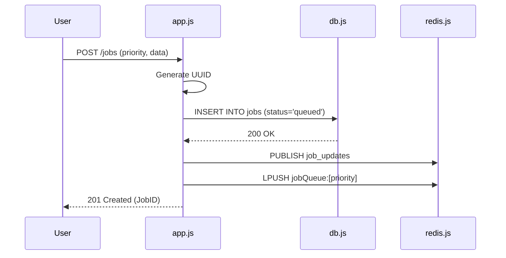
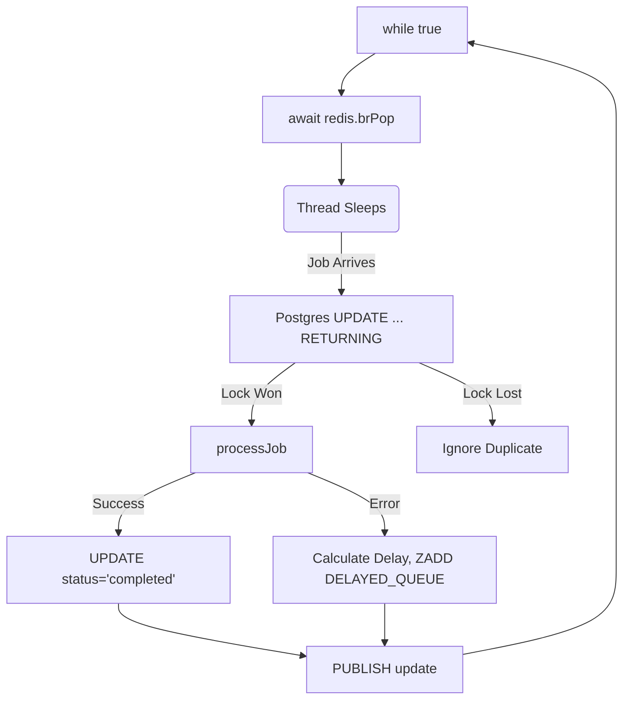

# 8. Detailed Codebase Breakdown

This document provides a massive, line-by-line architectural breakdown of the 5 core files that make up the QueueFlow backend. For every file, I provide a Mermaid flow diagram, function-by-function explanations, Big O time complexities, and the underlying "Why" for every code decision.

---

## 1. `queues.js` (The Contract)

### 1.1 Core Responsibility
This file is the single source of truth for the Redis key definitions. It acts as the structural contract between the Producer (`app.js`) and the Consumer (`worker.js`).

### 1.2 The Code Breakdown
```javascript
const QUEUE_PREFIX = 'jobQueue';

const QUEUES_IN_PRIORITY_ORDER = [
  `${QUEUE_PREFIX}:high`,
  `${QUEUE_PREFIX}:normal`,
  `${QUEUE_PREFIX}:low`,
];

const DELAYED_QUEUE = 'jobQueue:delayed';
```

### 1.3 Function & Flow Analysis
*   **The Array Order:** The order of `QUEUES_IN_PRIORITY_ORDER` is absolutely critical. It is passed directly into the Redis `BRPOP` command. Redis evaluates arrays strictly from left to right (Index 0 $\rightarrow$ Index $N$). By hardcoding the array in this specific order, we implement an $O(1)$ Priority Queue without requiring any CPU sorting algorithms.
*   **The Constant `DELAYED_QUEUE`:** This key points to a Redis Sorted Set (ZSET), whereas the priority queues are standard Redis Lists. It is separated because it uses entirely different commands (`ZADD`, `ZRANGEBYSCORE`) and operates on a time-based mechanism rather than a push/pop mechanism.

---

## 2. `redis.js` (The Infrastructure Connection)

### 2.1 Core Responsibility
This file manages the physical TCP sockets connecting the Node.js V8 runtime to the Redis in-memory datastore. It is responsible for connection resilience, exponential backoff during network drops, and instantiating duplicate clients for Pub/Sub.

### 2.2 The Flow Diagram
```mermaid
flowchart TD
    Init[createRedisClient()] --> Connect[client.connect()]
    Connect -- Success --> Export[Export Ready Client]
    Connect -- Failure --> Catch[Log Error]
    Catch --> Reconnect[reconnectStrategy]
    Reconnect --> |retries * 100ms| Connect
```

### 2.3 Function & Flow Analysis

#### `createRedisClient()`
*   **Mechanism:** Instantiates a new Redis v4 client. It injects the `REDIS_URL` from the environment.
*   **Reconnection Strategy:** I passed a custom `socket.reconnectStrategy` function. If the socket drops, it executes `Math.min(retries * 100, 3000)`.
    *   *Why?* If Redis crashes, Node.js will try to reconnect instantly. Without this math, Node might spam Redis with 10,000 connection requests per second, causing a self-inflicted DDoS. This math enforces a dynamic delay, capped at 3 seconds, allowing Redis time to boot up.

#### `const redis = createRedisClient()` vs `const redisPubSub = createRedisClient()`
*   **Mechanism:** I deliberately invoke the factory function twice, creating two entirely separate, isolated TCP connections.
*   **Why? (Crucial):** Redis commands like `BRPOP` and `SUBSCRIBE` are **blocking commands**. When a client executes them, that specific TCP socket is frozen until data arrives. If I only used one client, the moment I executed `BRPOP`, I would be physically unable to execute `PUBLISH` or `ZADD` on that same client. Duplicating the clients completely segregates the Blocking operations from the Standard operations.

---

## 3. `db.js` (The Source of Truth)

### 3.1 Core Responsibility
This file manages the connection to PostgreSQL using the `pg` library. It initializes the Connection Pool and exposes a clean query interface.

### 3.2 Function & Flow Analysis

#### `new Pool({ connectionString, max: 20, idleTimeoutMillis: 30000 })`
*   **Mechanism:** Initializes a pool of 20 persistent TCP connections to Postgres.
*   **Why?** Opening a new Postgres connection takes ~20-50ms (SSL handshake, authentication). If 1,000 users hit the Express API, creating 1,000 connections would take 50 seconds and crash the database RAM. By capping it at `max: 20`, 20 requests execute instantly, and the remaining 980 are safely buffered in Node.js memory, executing the microsecond a connection frees up.
*   `idleTimeoutMillis`: If a connection sits idle for 30 seconds, it is destroyed to save database RAM, keeping the infrastructure incredibly lean during off-peak hours.

---

## 4. `app.js` (The Producer / API Gateway)

### 4.1 Core Responsibility
This Express server acts as the Producer. It is responsible for data validation, the "Database-First" guarantee, and managing the WebSockets that push real-time UI updates to the React client.

### 4.2 The Flow Diagram (POST /jobs)


### 4.3 Function & Flow Analysis

#### `app.post('/jobs', ...)`
*   **Time Complexity:** $O(1)$ for the API, $O(1)$ for Postgres `INSERT`, $O(1)$ for Redis `LPUSH`. Extremely fast.
*   **The Database-First Guarantee:** Notice the strict sequential execution using `async/await`. We `await db.query(...)` *before* we touch Redis. If Postgres throws an error (e.g., connection lost), it drops into the `catch` block and returns a 500 error. The job is never pushed to Redis. This mathematically guarantees we never have a ghost job floating in Redis that doesn't exist in the database.

#### `app.get('/stats', ...)`
*   **Time Complexity:** $O(N)$ where N is the number of rows in the table (Sequential Scan).
*   **Mechanism:** Executes a single `COUNT(*) FILTER` query.
*   **Why?** A junior dev would write 4 separate `SELECT COUNT(*)` queries for queued, processing, completed, and failed. This would force Postgres to scan the table 4 times. Using `FILTER` aggregates all 4 metrics in a single pass, massively reducing CPU load.

#### `redisPubSub.subscribe('job_updates', (message))`
*   **Mechanism:** The dedicated Pub/Sub client listens continuously. When a worker finishes a job, this callback fires, parses the message, and executes `io.emit('job_updated', data)`.
*   **Why?** This is the magic behind the real-time UI. It decouples the React frontend from the database entirely, allowing millions of UI updates without generating a single Postgres query.

---

## 5. `worker.js` (The Consumer / State Machine)

### 5.1 Core Responsibility
This is the most complex file in the architecture. It is a headless daemon that runs infinitely. It pulls jobs from Redis, executes the atomic locks in Postgres, processes the LLM payloads, manages Exponential Backoff, and runs the self-healing Reaper loops.

### 5.2 The Flow Diagram (The Worker Loop)


### 5.3 Function & Flow Analysis

#### `runWorkerLoop()`
*   **Mechanism:** An infinite `while(true)` loop.
*   **Why?** By pairing it with `await redis.brPop(QUEUES_IN_PRIORITY_ORDER, 5)`, it achieves non-polling blocking. The Event Loop suspends this specific function context. When a job arrives, the OS wakes the Event Loop. If no job arrives for 5 seconds, it wakes up anyway (timeout = 5) to ensure the `setInterval` maintenance functions aren't completely starved.

#### `processJob(jobId)`
*   **The Atomic Lock:** Executes `UPDATE jobs SET status = 'processing', processing_token = $2 WHERE id = $1 AND status = 'queued' RETURNING *`.
    *   *Big O:* $O(\log N)$ due to the B-Tree index lookup on `id`.
    *   *Why?* Optimistic Concurrency Control. Postgres places a row-level lock here. If two workers pop the exact same job ID from Redis due to a network glitch, only one worker wins this lock. The loser receives `rows.length === 0` and silently drops the job.
*   **The Business Logic:** The `await sleep(JOB_PROCESSING_MS)` simulates a heavy I/O task (like an OpenAI inference). The Node Event Loop is completely unblocked during this sleep.
*   **The Error Boundary:** Wrapped in a massive `try/catch`. If the job succeeds, it updates Postgres to `completed` ($O(\log N)$). If it fails, it executes the Backoff algorithm.

#### The Exponential Backoff Implementation (Inside `catch`)
*   **Mechanism:** `const backoffMs = Math.min(RETRY_BASE_MS * (2 ** retry_count), 60000)`.
*   **Flow:** It calculates the future timestamp: `Date.now() + backoffMs`. It executes `redis.zAdd(DELAYED_QUEUE, score, payload)`.
*   **Why?** If OpenAI goes down, retrying instantly creates a DDoS attack (Thundering Herd). This spreads the retries out logarithmically. It caps at 60 seconds to prevent jobs from being delayed for days.

#### `promoteDueRetries()` (Runs every 2 seconds)
*   **Mechanism:** `ZRANGEBYSCORE DELAYED_QUEUE 0 Date.now()`.
*   **Big O:** $O(\log N + M)$ in Redis.
*   **Flow:** Fetches all jobs whose retry timers have expired. It executes `ZREM`. If `ZREM` succeeds, it pushes the job back to the active `jobQueue:high`.
*   **Why?** We must check `ZREM === 1`. Because multiple workers are running this function every 2 seconds, two workers might both grab the same delayed job. `ZREM` acts as a Redis-level atomic lock.

#### `recoverStalledProcessingJobs()` (The Reaper - Runs every 15 seconds)
*   **Mechanism:** `UPDATE jobs SET status = 'queued', processing_token = NULL WHERE status = 'processing' AND updated_at < NOW() - 60s`.
*   **Big O:** $O(\log N)$ thanks to the Composite Index `(status, updated_at)`.
*   **Why?** This prevents Zombie Jobs. If a worker container suffers a kernel panic or an OOM kill mid-processing, the Postgres lock is stuck forever. This Reaper acts as the garbage collector, forcefully breaking the lock and resetting the job after 60 seconds of silence.

#### `recoverMissingQueuedJobs()` (The Auditor - Runs every 15 seconds)
*   **Mechanism:** Queries Postgres for all `status='queued'`. Executes `LRANGE` on all Redis queues. Intersects them. If Postgres has a job that Redis lacks, it executes `LPUSH`.
*   **Why?** This provides immunity against Redis Cache Wipes. If Redis restarts and all RAM is lost, this function rebuilds the entire queue architecture from the immutable Postgres ledger in exactly 15 seconds.
