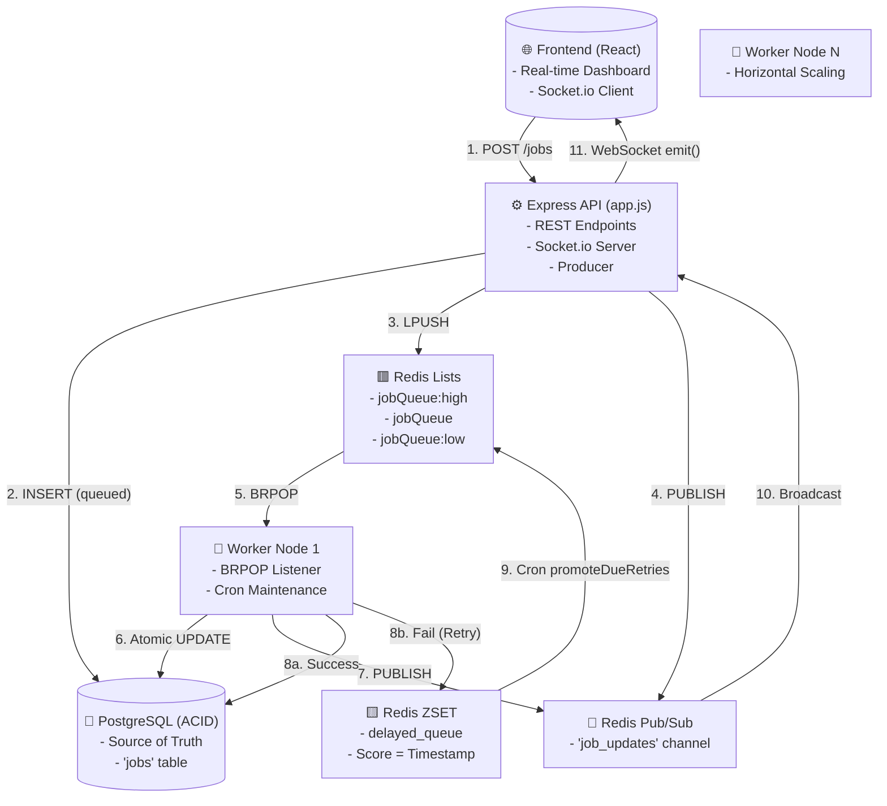
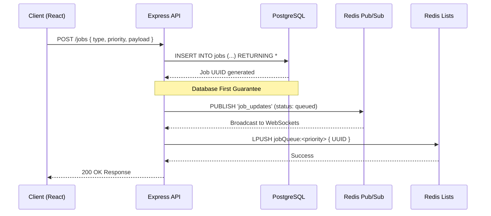
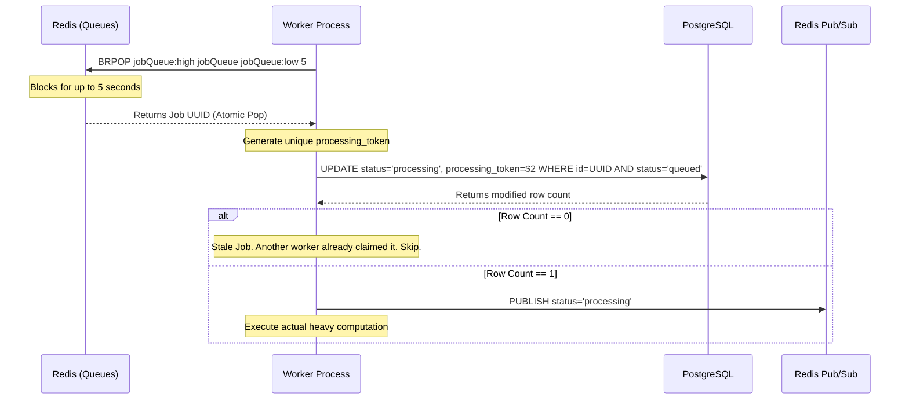
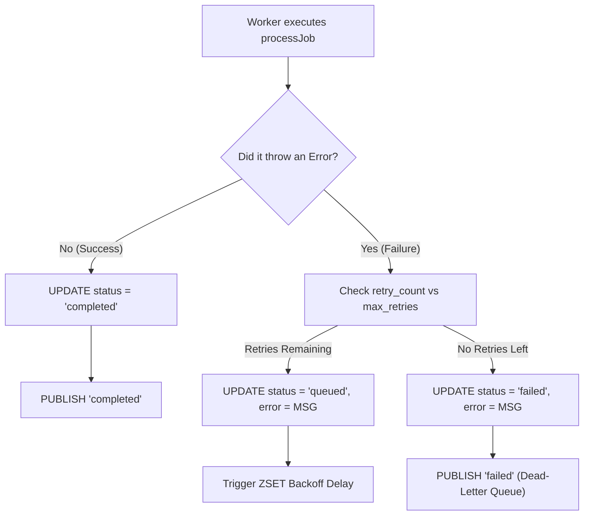
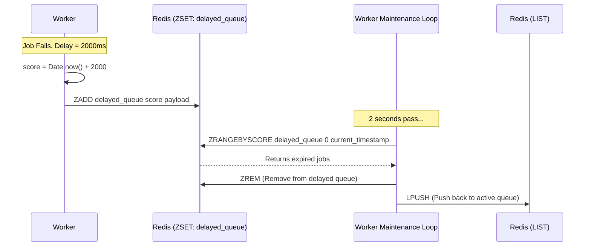
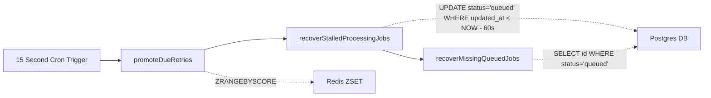
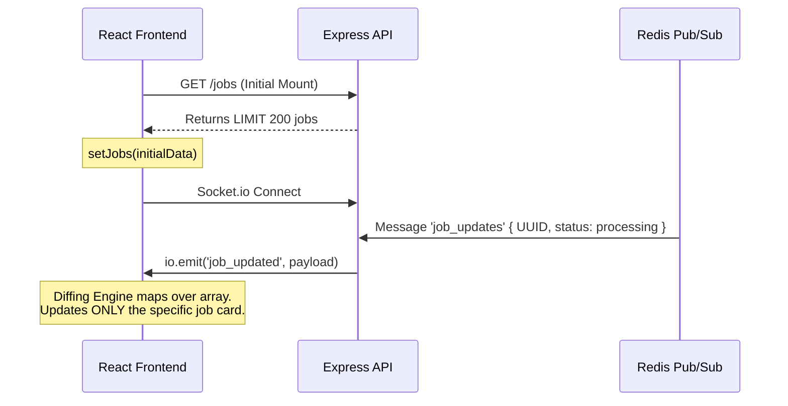

# QueueFlow: End-to-End Architectural Flow

This master document details every single micro-interaction, database state change, and queue operation that occurs across the entire system. It combines high-level theory with the exact implementation steps used in the project, serving as the ultimate reference guide for the QueueFlow architecture.

---

## 1. Global System Architecture

Before diving into individual lifecycles, it is critical to understand how the entire ecosystem fits together. QueueFlow is built on a **CQRS-inspired, dual-datastore architecture** where PostgreSQL acts as the durable source of truth and Redis acts as the ephemeral, high-speed broker.



### Theory: CQRS & The Dual-Datastore Architecture
A common interview question is: *"QueueFlow uses both Postgres and Redis. Why not just use one database?"*

QueueFlow is built on a **CQRS-inspired** (Command Query Responsibility Segregation) architecture. In traditional apps, you use one database to do absolutely everything. In a CQRS system, you split responsibilities, using one system optimized for *writing/storing* data, and another optimized for *routing/reading* data.

We utilize a **Dual-Datastore** approach, combining two databases to utilize their unique strengths rather than forcing one to do a job it's bad at:
- **PostgreSQL acts as the Durable Source of Truth.** It writes data to a physical hard drive and provides ACID guarantees. If someone unplugs your server, data is not lost. More importantly, it holds the absolute undeniable state of every job. If Redis says a job is "queued" but Postgres says "completed", *Postgres is right*.
- **Redis acts as the Ephemeral, High-Speed Broker.** Redis lives entirely in RAM (ephemeral) and is ridiculously fast. We don't use Redis to *store* data permanently; we use it as a broker to instantly hand out job IDs to workers the millisecond they arrive using `BRPOP`.

**The Synergy:**
If we only used Postgres, our workers would have to constantly spam the database with `SELECT * FROM jobs WHERE status='queued'` every second (Polling), which would overload the CPU and crash the database at scale.
If we only used Redis, our system would be incredibly fast, but a server crash would wipe out thousands of jobs instantly, resulting in massive data loss.
By combining them, **Postgres guarantees we never lose a job, and Redis guarantees we process them instantly without overloading Postgres.**

---

## 2. The Producer Lifecycle (Job Creation)

When a user submits a job via the Dashboard (or the `simulate.js` burst script), the system executes a strict sequence to guarantee that no jobs are ever dropped.



### Theory: The "Database-First" Guarantee
Notice the exact order of operations. We `INSERT` into PostgreSQL *before* we push to Redis.
If the Express API server suddenly loses power exactly 1 millisecond after step 2:
- The job is safely saved in PostgreSQL as `queued`.
- It never made it to Redis, so workers don't know it exists.
- **Recovery:** When the workers boot back up, their `recoverMissingQueuedJobs()` startup script finds this orphaned job in Postgres and pushes it to Redis automatically. No data loss.

Furthermore, notice that we `PUBLISH` to Pub/Sub *before* we `LPUSH` to the queue. If we pushed to the queue first, a hyper-fast worker might grab the job and broadcast the `processing` event before the API could broadcast the `queued` event, causing the UI to hallucinate.

---

## 3. The Consumer Lifecycle & Atomic Locking

The worker nodes act as greedy consumers in an infinite `while(true)` loop. Because there can be multiple workers running on different servers, we must handle race conditions.



### Theory: Optimistic Concurrency Control (Atomic Locks)
The hardest problem in distributed queues is preventing two workers from processing the same job. 
While `BRPOP` guarantees only one worker gets the job ID from Redis, network glitches or crash recovery scripts can sometimes result in duplicate IDs floating in Redis.

To solve this, we rely on **PostgreSQL Row-Level Locking**.
```sql
UPDATE jobs 
SET status = 'processing', processing_token = $2 
WHERE id = $1 AND status = 'queued'
```
Even if two workers fire this exact query at the exact same millisecond, PostgreSQL physically locks the row on disk. The first query succeeds and changes the status to `'processing'`. The second query then executes, but because the `WHERE status = 'queued'` condition is no longer true, it affects 0 rows. The second worker realizes it lost the race and drops the job. The `processing_token` (a random UUID) securely binds the job to the winning worker.

---

## 4. Execution Outcomes (Success & Failure)

Once the worker has claimed the job and locked it with its `processing_token`, it begins execution.



### Theory: Idempotency
Why do we track state so rigorously? Because jobs must be **Idempotent**—meaning if a job runs twice, it shouldn't cause unintended side effects (like charging a credit card twice). By locking the job with a `processing_token`, we ensure that if a worker takes too long and is presumed dead, we don't accidentally run the job twice concurrently.

---

## 5. Exponential Backoff & The Delayed Queue

When a job fails but has retries remaining, it must be delayed to prevent a "Thundering Herd" API crash.



### Theory: Durable Delays vs In-Memory Timers
In a naive Node.js implementation, developers use `setTimeout()` to wait before retrying. 
**The danger:** If the server crashes during that timeout, the memory is wiped, and the job is permanently lost.
**The solution:** QueueFlow calculates the exact future execution timestamp and uses `ZADD` to store it in a Redis Sorted Set. A background cron loop polls this set using `ZRANGEBYSCORE`. Because the delay state is held externally in Redis, you can restart your Node.js servers a thousand times and never lose a single pending retry.

---

## 6. Worker Maintenance Cycles (Self-Healing)

A robust distributed system must be able to heal itself. The worker runs a maintenance loop via `setInterval` every 15 seconds.



### Theory: Handling Silent Crashes
What happens if a worker pulls a job, updates Postgres to `processing`, and then the server's power cable is unplugged? The job is stuck in `processing` forever.
The `recoverStalledProcessingJobs` script solves this by searching Postgres for jobs that have been processing for more than 60 seconds (`updated_at < NOW() - INTERVAL '60 seconds'`). It safely assumes the worker died, wipes the `processing_token` lock, resets them to `queued`, and re-pushes them to Redis.

---

## 7. Manual Interventions (Retry & Purge)

The dashboard allows human intervention for edge cases.

### The Dead-Letter Queue (DLQ)
When a job exceeds `max_retries` (default 3), it is marked as `failed`. This is the **Dead-Letter Queue**.
When a developer clicks "Retry" on the dashboard:
1. The API executes an atomic SQL query: `UPDATE jobs SET status = 'queued', retry_count = 0, error = NULL WHERE id = $1 AND status = 'failed' RETURNING *`
2. It pushes the job back to the Redis queues via `LPUSH`.

### The Nuclear Purge
When a user clicks "Purge All":
1. The API executes `TRUNCATE TABLE jobs` in Postgres (vastly faster than row-by-row `DELETE`).
2. It executes `DEL` on all Redis keys.
3. It broadcasts a `purge` event via PubSub, triggering all connected React clients to instantly wipe their local state arrays to `[]`.

---

## 8. Frontend Hydration & Zero-Latency Sync

The React frontend requires zero HTTP polling to stay perfectly synced with the backend.



### Theory: The 200-Job UI Safeguard
When running load tests with 10,000+ jobs, sending 10,000 DOM elements to React will instantly crash the user's browser (Out of Memory). 
QueueFlow implements a hard `LIMIT 200` on the initial `GET /jobs` fetch. The dashboard acts as a "window" into the latest activity. Global statistics (like "10,000 Queued") remain 100% accurate because they are powered by the backend `COUNT(*) FILTER` query, separating the UI render limit from the mathematical truth.
