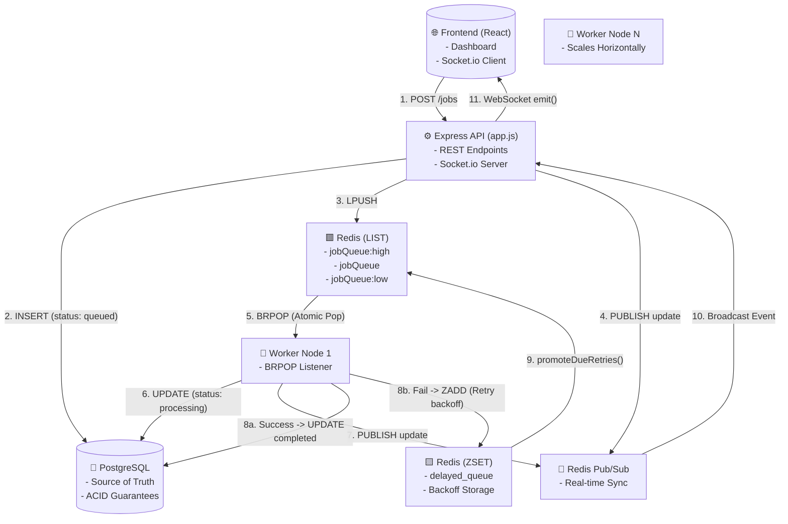
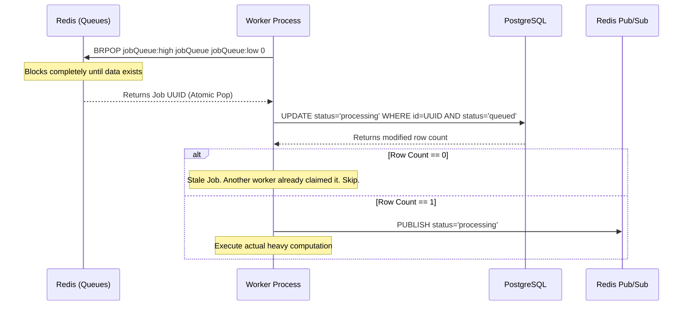
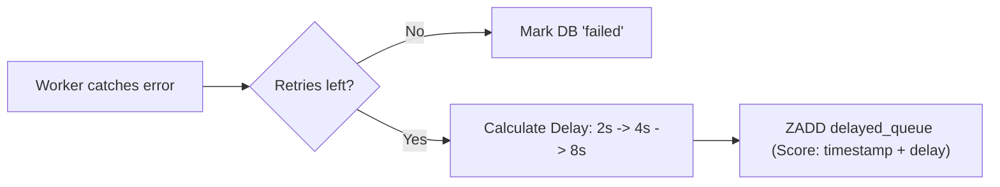

# QueueFlow: End-to-End Architectural Flow

This document details every single micro-interaction, database state change, and queue operation that occurs across the entire system—from job creation and automated consumption to manual dashboard interventions.

---

## 1. High-Level System Architecture Diagram



---

## 2. Step-by-Step Flow: Automated Job Creation (The Producer)

When a user submits a job via the Dashboard, the `/jobs` REST endpoint, or the `simulate.js` burst script, the system executes a strict sequence to ensure data durability.

### The Flow
1. **Request Received**: The Express API receives a `POST /jobs` payload containing `type`, `payload`, and `priority`.
2. **Database Insertion (Source of Truth)**: 
   - The API instantly performs an `INSERT INTO jobs` into PostgreSQL. 
   - The job receives a UUID, a default `retry_count` of 0, and a `status` of `'queued'`.
   - *Architecture Decision:* We write to DB first. If the API crashes *after* the DB insert but *before* pushing to Redis, our **Crash Recovery** script will find the orphaned job on reboot.
3. **Queue Push (Redis `LPUSH`)**: 
   - The API determines the correct Redis key based on priority (e.g., `jobQueue:high`).
   - It executes an O(1) `LPUSH` operation, pushing a lightweight JSON payload (ID, type, priority, payload) to the head of the Redis List.
4. **Real-time Sync (Pub/Sub)**:
   - The API uses `redis.publish('job_updates', JSON.stringify(job))` to broadcast the creation.
   - The Socket.io server (attached to the Express API) listens to this channel and emits a websocket event to the React frontend to inject the new card instantly.

---

## 3. Step-by-Step Flow: Worker Consumption & Atomic Claims

The worker nodes act as greedy consumers in an infinite `while(true)` loop.



### The Race Condition Prevention (The Hardest Problem)
When multiple workers execute `BRPOP`, Redis guarantees that only **one** worker receives the popped element. However, what if a worker crashes, the job is recovered by the crash script, and *two* identical UUIDs end up in the Redis queue by accident?

We solve this using **Optimistic Concurrency Control** in PostgreSQL:
```sql
UPDATE jobs 
SET status = 'processing', processing_token = $2 
WHERE id = $1 AND status = 'queued'
```
Because of PostgreSQL's row-level locks, even if two workers try to execute this query at the exact same millisecond, only the first one will successfully change the status from `'queued'`. The second worker will get 0 rows returned, realize the job is stale, and safely drop it.

---

## 4. Step-by-Step Flow: Execution & Outcomes

Once the worker has claimed the job and locked it with a unique UUID `processing_token`, it begins simulated execution (`sleep` + random failure check).

### Scenario A: Success
1. The worker finishes the workload.
2. It executes an atomic `UPDATE` setting `status = 'completed'` where `processing_token` matches its local token.
3. It broadcasts a `completed` event via Redis Pub/Sub.

### Scenario B: Failure (Exception Thrown)
1. The worker catches the error.
2. It queries PostgreSQL for the current `retry_count` and `max_retries`.
3. If `retry_count < max_retries`, it triggers the **Exponential Backoff Flow** (see below).
4. If `retry_count == max_retries`, it marks the job as `failed` (Dead-letter), saves the error trace to the `error` column, and broadcasts the failure to the frontend.

---

## 5. Step-by-Step Flow: Exponential Backoff (Redis ZSET)

When a job fails but has retries remaining, it is delayed to prevent a "Thundering Herd" API crash.



### The ZSET Mechanics
1. **Scoring**: The worker calculates the delay (e.g., 4000ms). It sets the Redis ZSET `score` to the exact UNIX timestamp when the job should execute (`Date.now() + 4000`).
2. **Storage**: It executes `ZADD delayed_queue <score> <job_payload>`. Because it's stored in Redis, the delay is 100% durable against worker crashes.

---

## 6. Step-by-Step Flow: The Worker Maintenance Cycle (Cron Loop)

To handle the `ZSET` promotions and detect stalled jobs, the worker runs a maintenance loop via `setInterval` every `15,000ms` (15 seconds).

1. **`promoteDueRetries()`**: 
   - Runs `ZRANGEBYSCORE delayed_queue 0 <current_timestamp>`.
   - Takes all jobs whose delay timestamp has passed, removes them using `ZREM`, and pushes them back to standard Redis lists via `LPUSH`.
2. **`recoverStalledProcessingJobs()`**:
   - Queries PostgreSQL for jobs stuck in `processing`: `WHERE status = 'processing' AND updated_at < NOW() - 60 seconds`.
   - If a job has been processing for >60s, it assumes the worker holding it died silently (OOM, power failure).
   - It resets the DB status to `queued`, wipes the `processing_token`, and re-pushes it to Redis to be picked up by a healthy worker.

---

## 7. Step-by-Step Flow: Node Startup & Crash Recovery

Every time a Worker Node boots up, before it connects to `BRPOP`, it runs `recoverMissingQueuedJobs()`:
1. It queries PostgreSQL: `SELECT id FROM jobs WHERE status = 'queued'`.
2. It queries Redis: Give me every job currently sitting in the lists and ZSETs.
3. It compares them. If a job is `queued` in the DB but nowhere to be found in Redis, it means a crash happened immediately after DB insertion but before `LPUSH`. The worker immediately re-pushes it to Redis.

---

## 8. Step-by-Step Flow: Manual Retry (Dashboard Action)

When a user clicks the physical "Retry" button on a Failed job card in the React UI:
1. UI sends `POST /jobs/<UUID>/retry` to the Express API.
2. The API executes an atomic SQL query:
   ```sql
   UPDATE jobs 
   SET status = 'queued', retry_count = 0, error = NULL 
   WHERE id = $1 AND status = 'failed' RETURNING *
   ```
3. If successful, the API executes an `LPUSH` back into the Redis priority queues.
4. The API broadcasts the `queued` state change via Pub/Sub, updating the UI instantly.

---

## 9. Step-by-Step Flow: The Purge Action (Nuclear Reset)

When a user clicks "Purge All":
1. UI sends `DELETE /jobs` to the Express API.
2. The API executes a `TRUNCATE TABLE jobs` (vastly faster than row-by-row `DELETE`).
3. The API executes Redis `DEL` on all queue keys (`jobQueue:high`, `jobQueue`, `jobQueue:low`, `delayed_queue`).
4. The API broadcasts a special `purge` event via Pub/Sub, triggering all connected React clients to instantly wipe their local arrays (`setJobs([])`).

---

## 10. Step-by-Step Flow: Frontend Hydration & UI Rendering

1. **Initial Load**: The React app mounts and hits `GET /jobs`. The API returns a hard limit of `200` jobs (`ORDER BY created_at DESC`). 
   - *Design Choice:* The `LIMIT 200` safeguard prevents browser memory crashes when 10,000+ jobs are fired during load testing.
2. **WebSocket Handshake**: The frontend connects to the Socket.io server and begins listening to `job_updates`.
3. **Diffing Engine**: When a WebSocket update arrives, React maps over the existing `jobs` array. It performs an optimistic local state replacement of the updated job, maintaining UI layout integrity without triggering a full re-fetch of the 200 jobs.
4. **Time Calculation**: The UI constantly calculates `timeAgo()` based on exact seconds (`0s`, `1s`), allowing the user to visually validate the 2s, 4s, 8s exponential backoff delay happening on the backend.
