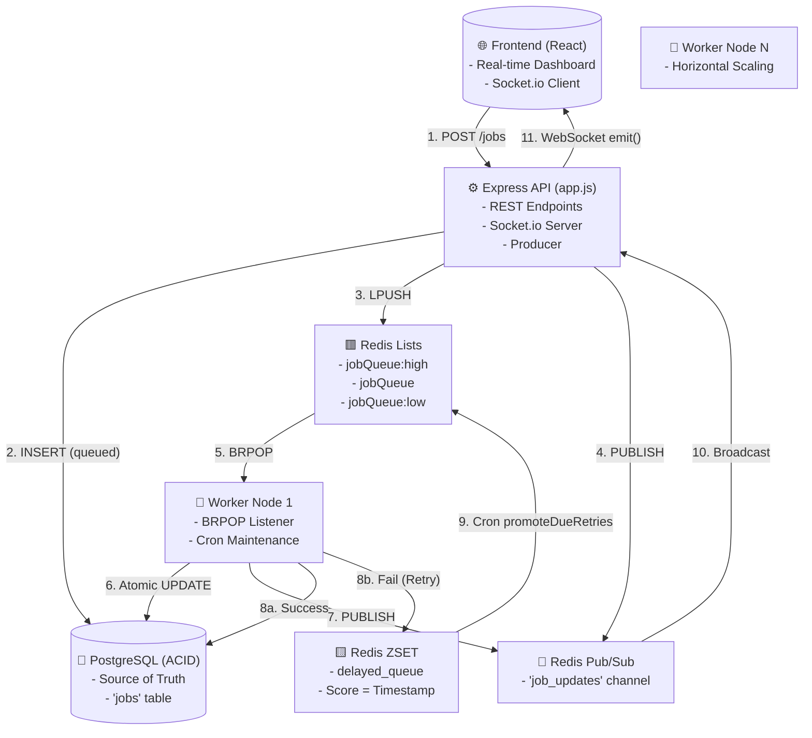
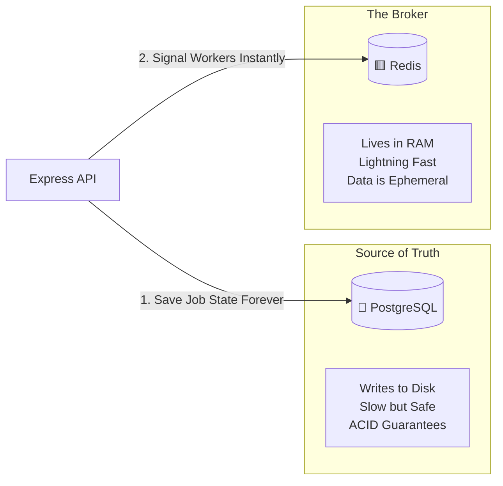
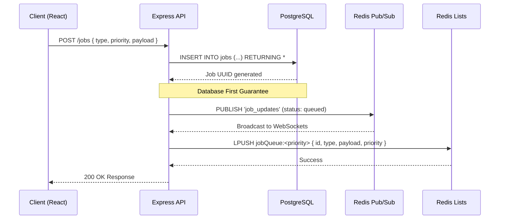
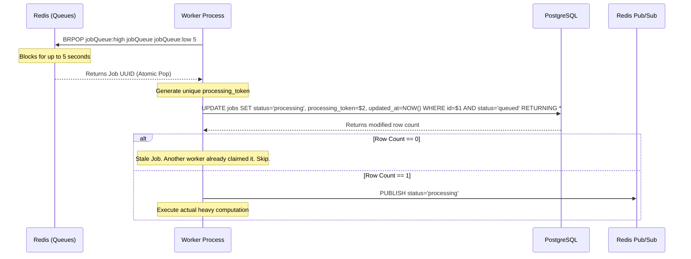
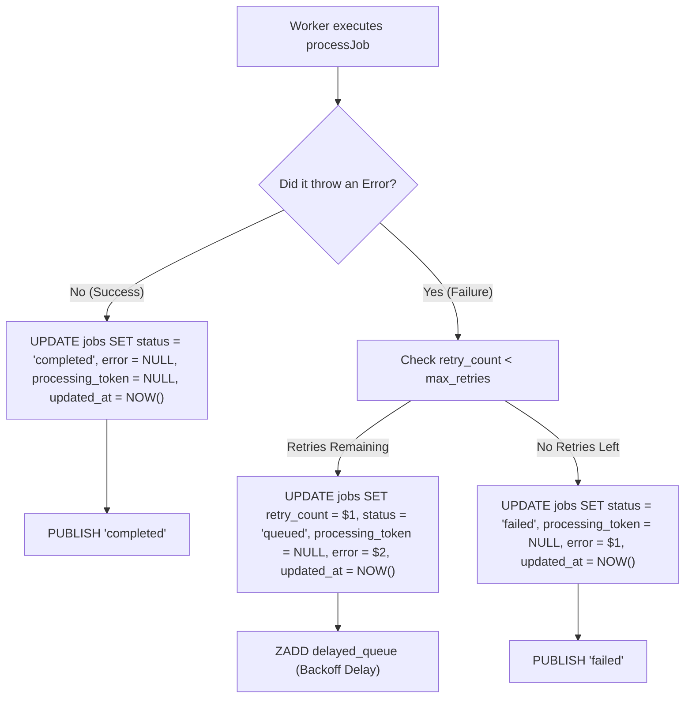
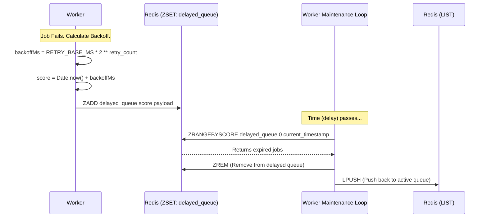
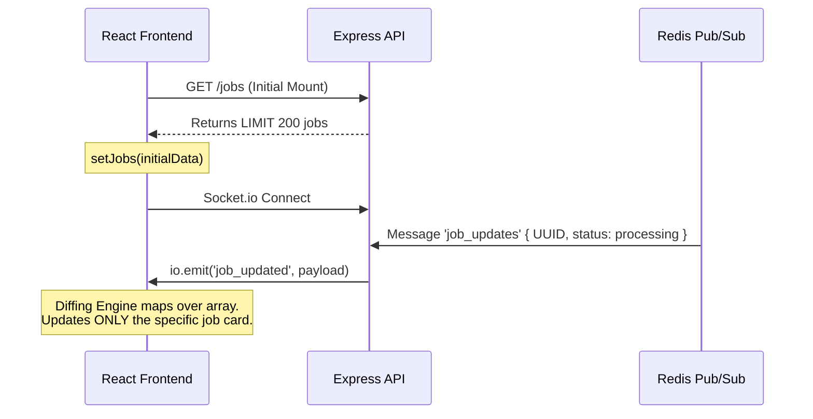
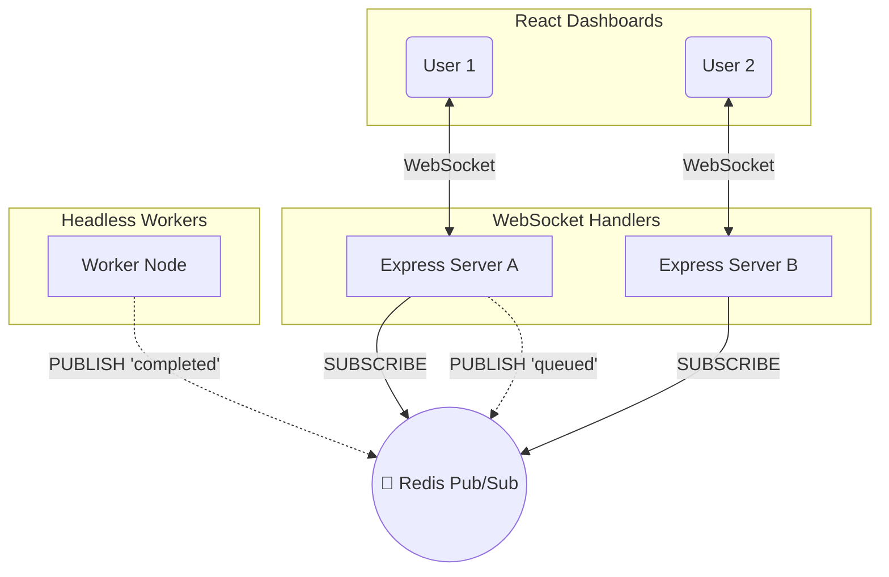

# QueueFlow: End-to-End Architectural Flow

This master document details every single micro-interaction, database state change, and queue operation that occurs across the entire system. It combines high-level theory with the exact implementation steps used in the project, serving as the ultimate reference guide for the QueueFlow architecture.

---

## 1. Global System Architecture

Before diving into individual lifecycles, it is critical to understand how the entire ecosystem fits together. QueueFlow is built on a **CQRS-inspired, dual-datastore architecture** where PostgreSQL acts as the durable source of truth and Redis acts as the ephemeral, high-speed broker.



### Theory: CQRS & The Dual-Datastore Architecture
A common interview question is: *"QueueFlow uses both Postgres and Redis. Why not just use one database?"*

Let's break this sentence down piece by piece.

1. **"CQRS-Inspired"**
CQRS stands for Command Query Responsibility Segregation. In traditional apps, you use one database (like PostgreSQL) to do absolutely everything: storing data, searching data, and managing state. In a CQRS system, you split responsibilities. You use one system optimized for writing/storing data, and a completely different system optimized for routing/reading data. QueueFlow is inspired by this because we split the workload between Postgres (for state) and Redis (for speed).

2. **"Dual-Datastore Architecture"**
This simply means we are purposely using two different databases in tandem, utilizing the unique strengths of each rather than forcing one database to do a job it's bad at.

3. **"PostgreSQL acts as the durable source of truth"**
- **Durable:** PostgreSQL writes data directly to a physical hard drive. If someone unplugs your database server, you do not lose your data.
- **Source of Truth:** This is the most important part. In a distributed system, servers get confused. If Redis says a job is "queued" but PostgreSQL says the job is "completed", PostgreSQL is right. Postgres holds the absolute, final, undeniable state of every job.

4. **"Redis acts as the ephemeral, high-speed broker"**
- **Ephemeral:** Redis lives entirely in RAM (Random Access Memory). It does not write to a hard drive by default. If Redis loses power, all the data inside it vanishes instantly.
- **High-Speed Broker:** Because it lives in RAM, Redis is ridiculously fast. We don't use Redis to store data permanently; we use it as a "broker" (a traffic cop) to instantly hand out job IDs to workers the millisecond they arrive, using the `BRPOP` command.

### The Synergy (Why we need both)
If we only used Postgres, our workers would have to constantly spam the database with `SELECT * FROM jobs WHERE status='queued'` every second (Polling). This would overload the database CPU and crash it at scale.

If we only used Redis, our system would be incredibly fast, but a server crash would wipe out thousands of jobs instantly, resulting in massive data loss.

By combining them, we get the best of both worlds: Postgres guarantees we never lose a job, and Redis guarantees we process them instantly without overloading Postgres.

### 📊 Visualizing the Dual-Datastore


### Diagram Explanation
1. **The Entry Point: Express API**
On the far left, you have the Express API. This acts as your "Producer." When a user submits a job via the React dashboard, this is the first place the data lands. The API's job is to route that data to the two different databases.

2. **The Bottom Path: "1. Save Job State Forever" (PostgreSQL)**
Even though it rendered on the bottom, the label correctly starts with "1". This visualizes your **Database-First Guarantee**.
Before the API tells any worker that a job exists, it must write the job to the "Source of Truth" (PostgreSQL). The text below the database explicitly explains why: Postgres writes to a physical disk and provides ACID guarantees. If your server cluster loses power a microsecond later, the job is safe.

3. **The Top Path: "2. Signal Workers Instantly" (Redis)**
Once the job is safely saved on disk, the API moves to step "2".
It shoots a signal over to "The Broker" (Redis). Because Redis lives entirely in volatile RAM (as the box explains), it shouldn't be trusted to hold the permanent state of the job. Instead, its only purpose is to be "Lightning Fast". It instantly alerts the greedy worker nodes that are listening via `BRPOP` that a new job is ready to be picked up.

**Why this is a perfect CQRS Visualization:**
It clearly shows that you are not forcing one database to do all the work. You are purposefully segregating the workload:
- **PostgreSQL** takes the heavy burden of being "Slow but Safe" to guarantee no data loss.
- **Redis** takes the burden of being "Lightning Fast" to guarantee your workers have zero latency when grabbing new jobs.

### ⚡ Application in QueueFlow Project
Here is exactly how this philosophy is implemented in your QueueFlow code:

**1. The Database-First Guarantee (`app.js`)**
When a user creates a job, your API routes it to PostgreSQL first:
```javascript
// 1. Save to the Durable Source of Truth FIRST
await pool.query('INSERT INTO jobs ...');

// 2. Then, hand it to the High-Speed Broker
await redis.lPush('jobQueue', jobId);
```

**2. Self-Healing Crash Recovery (`worker.js`)**
Because Redis is ephemeral (temporary), what happens if the Redis server crashes and wipes the queue? Your architecture survives this effortlessly. When your worker boots up, it runs `recoverMissingQueuedJobs()`. It looks at the Source of Truth (Postgres), finds all jobs where `status = 'queued'`, and simply re-pushes them back into the Broker (Redis). The system heals itself perfectly because of this dual-datastore design.

---

## 2. The Producer Lifecycle (Job Creation)

When a user submits a job via the Dashboard (or the `simulate.js` burst script), the system executes a strict sequence to guarantee that no jobs are ever dropped.



### Theory: The "Database-First" Guarantee
Notice the exact order of operations. We `INSERT` into PostgreSQL *before* we push to Redis.
If the Express API server suddenly loses power exactly 1 millisecond after step 2:
- The job is safely saved in PostgreSQL as `queued`.
- It never made it to Redis, so workers don't know it exists.
- **Recovery:** When the workers boot back up, their `recoverMissingQueuedJobs()` startup script finds this orphaned job in Postgres and pushes it to Redis automatically. No data loss.

Furthermore, notice that we `PUBLISH` to Pub/Sub *before* we `LPUSH` to the queue. If we pushed to the queue first, a hyper-fast worker might grab the job and broadcast the `processing` event before the API could broadcast the `queued` event, causing the UI to hallucinate.

---

## 3. The Consumer Lifecycle & Atomic Locking

The worker nodes act as greedy consumers in an infinite `while(true)` loop. Because there can be multiple workers running on different servers, we must handle race conditions.



👉 **Deep Dive:** [Read the full explanation of this Sequence Diagram, Timeouts, UUIDs, and Disaster Recovery here.](2.%20Consumer-Lifecycle-Deep-Dive.md)

### Theory: Optimistic Concurrency Control (Atomic Locks)

The hardest problem in distributed queues is preventing two workers from processing the same job. While `BRPOP` guarantees only one worker gets the job ID from Redis, network glitches or crash recovery scripts can sometimes result in duplicate IDs floating in Redis.

> [!IMPORTANT]
> **The Problem: The Double-Processing Nightmare**
> Imagine you run an e-commerce site, and a job in your queue is: "Charge Customer $100". You have 10 Worker Nodes running.
> Usually, when a worker uses `BRPOP`, Redis deletes the job so no other worker gets it. But networks are messy. If a network cable glitches or a self-healing script accidentally pushes the same job back into Redis, you suddenly have two copies of the "Charge Customer $100" job.
> Worker A grabs the first copy. Worker B grabs the second copy. They both try to charge the customer $100 at the exact same time. The customer gets charged $200. Disaster.

To solve this, we rely on **PostgreSQL Row-Level Locking**. We never trust Redis as the final source of truth.

When Worker A and Worker B grab the duplicate jobs from Redis, they don't immediately process them. First, they generate a random UUID (`processing_token`) and run to Postgres with this exact SQL query:

```sql
UPDATE jobs 
SET status = 'processing', processing_token = $2, updated_at = NOW()
WHERE id = $1 AND status = 'queued'
RETURNING *
```

#### The Race Condition (Row-Level Locking)
Even if Worker A and Worker B fire this SQL query at the exact same millisecond, Postgres is designed to handle this flawlessly using a Row-Level Lock.

**Who decides who goes first?**
It is a pure, microscopic race (a coin flip). Time inside a CPU is measured in nanoseconds. It is physically impossible for two signals to enter the database's processor at the exact same nanosecond. One of them will always cross the finish line a tiny fraction of a hair faster than the other due to random network jitter. Postgres simply gives priority to whichever signal hit the CPU first.

> [!NOTE]
> **The Bathroom Stall Analogy**
> To understand how Postgres forces them into a single-file line, imagine a single bathroom stall with a physical lock on the door.
> 1. **The Race:** Worker A and Worker B both run to the bathroom at the exact same time.
> 2. **The Lock:** Because Worker A was a nanosecond faster, Worker A grabs the door handle first. Worker A goes inside and locks the door. *(This is the Row-Level Lock).*
> 3. **The Waiting Room:** Worker B crashes into a locked door. Does Worker B's query fail and crash? No. PostgreSQL automatically makes Worker B wait patiently right outside the door.
> 4. **The Update:** While inside, Worker A checks the condition (`WHERE status = 'queued'`). It is there! Worker A takes it (changes status to `processing`), unlocks the door, and leaves happily (returns `1 row modified`).
> 5. **The Second Attempt:** Now the door is unlocked. Worker B immediately steps inside. Worker B checks for the condition (`WHERE status = 'queued'`). But it's gone. Worker A just took it.
> 6. **The Rejection:** Because the condition is no longer true, Worker B cannot do its job. It leaves empty-handed (returns `0 rows modified`).

**The Result:** Worker A sees `1 row modified`. It safely charges the customer $100. Worker B sees `0 rows modified`. It says, "Ah, another worker beat me to it," and throws the duplicate job in the trash.

This architectural pattern is called **Optimistic Concurrency Control (OCC)**. It guarantees that no matter how many duplicate jobs flood Redis, or how many workers are running, a job will be executed exactly once.

---

## 4. Execution Outcomes (Success & Failure)

Once the worker has claimed the job and locked it with its `processing_token`, it begins execution.



### Theory: Idempotency
Why do we track state so rigorously? Because jobs must be **Idempotent**—meaning if a job runs twice, it shouldn't cause unintended side effects (like charging a credit card twice). By locking the job with a `processing_token`, we ensure that if a worker takes too long and is presumed dead, we don't accidentally run the job twice concurrently.

---

## 5. Exponential Backoff & The Delayed Queue

When a job fails but has retries remaining, it must be delayed to prevent a "Thundering Herd" API crash.



👉 **Deep Dive:** [Read the full explanation of this Sequence Diagram, Thundering Herds, and In-Memory vs Durable Timers here.](3.%20Exponential-Backoff-Deep-Dive.md)

### Theory: Durable Delays vs In-Memory Timers
In a naive Node.js implementation, developers use `setTimeout()` to wait before retrying. 
**The danger:** If the server crashes during that timeout, the memory is wiped, and the job is permanently lost.
**The solution:** QueueFlow calculates the exact future execution timestamp and uses `ZADD` to store it in a Redis Sorted Set. A background cron loop polls this set using `ZRANGEBYSCORE`. Because the delay state is held externally in Redis, you can restart your Node.js servers a thousand times and never lose a single pending retry.

---

## 6. Worker Maintenance Cycles (Self-Healing)

A robust distributed system must be able to heal itself. The worker runs an infinite `while(true)` loop. Some maintenance tasks run on every iteration, while others only run every 15 seconds.

```mermaid
graph LR
    A[while(true) Loop Iteration] --> B[promoteDueRetries]
    
    A --> C{Has it been 15s?}
    C -- "Yes" --> D[recoverStalledProcessingJobs]
    D --> E[recoverMissingQueuedJobs]
    
    B -.->|ZRANGEBYSCORE| Z[Redis ZSET]
    D -.->|UPDATE jobs SET status='queued', error='Recovered...' WHERE updated_at < NOW - 60s| DB[Postgres DB]
    E -.->|SELECT id WHERE status='queued'| DB
```

### Theory: Handling Silent Crashes
What happens if a worker pulls a job, updates Postgres to `processing`, and then the server's power cable is unplugged? The job is stuck in `processing` forever.
The `recoverStalledProcessingJobs` script solves this by searching Postgres for jobs that have been processing for more than 60 seconds (`updated_at < NOW() - INTERVAL '60 seconds'`). It safely assumes the worker died, wipes the `processing_token` lock, resets them to `queued`, and re-pushes them to Redis.

---

## 7. Manual Interventions (Retry & Purge)

The dashboard allows human intervention for edge cases.

### The Dead-Letter Queue (DLQ)
When a job exceeds `max_retries` (default 3), it is marked as `failed`. This is the **Dead-Letter Queue**.
When a developer clicks "Retry" on the dashboard:
1. The API executes an atomic SQL query: `UPDATE jobs SET status = 'queued', retry_count = 0, error = NULL WHERE id = $1 AND status = 'failed' RETURNING *`
2. It pushes the job back to the Redis queues via `LPUSH`.

### The Nuclear Purge
When a user clicks "Purge All":
1. The API executes `TRUNCATE TABLE jobs` in Postgres (vastly faster than row-by-row `DELETE`).
2. It executes `DEL` on all Redis keys.
3. It broadcasts a `purge` event via PubSub, triggering all connected React clients to instantly wipe their local state arrays to `[]`.

---

## 8. Frontend Hydration & Zero-Latency Sync

The React frontend requires zero HTTP polling to stay perfectly synced with the backend.



### Theory: The 200-Job UI Safeguard
When running load tests with 10,000+ jobs, sending 10,000 DOM elements to React will instantly crash the user's browser (Out of Memory). 
QueueFlow implements a hard `LIMIT 200` on the initial `GET /jobs` fetch. The dashboard acts as a "window" into the latest activity. Global statistics (like "10,000 Queued") remain 100% accurate because they are powered by the backend `COUNT(*) FILTER` query, separating the UI render limit from the mathematical truth.

---

## 9. The Need for Redis Pub/Sub (The Multi-Server Problem)

A common point of confusion is: *"Why do we need Redis Pub/Sub? Why can't the Worker just emit a WebSocket event to the React frontend directly when a job is done?"*

**The Analogy: The Restaurant**
Imagine your architecture is a restaurant:
- **The Customer** is the React Frontend sitting at a table.
- **The Waiter** is the Express API (handling the WebSocket connection).
- **The Chef** is the Worker Node in the kitchen cooking jobs.

The Chef never talks to the Customers directly. When the Chef finishes cooking a meal (Job Completed), how does the Customer know? The Chef can't walk out and tell them (the Worker has no WebSocket connections). 
Instead, the Chef rings a loud bell in the kitchen (**Redis Pub/Sub**). All the Waiters hear the bell, check the order, and the specific Waiter walks over to the Customer and tells them it's ready.

### Why Direct WebSockets Fail at Scale
If you deploy your app to the cloud, you will have multiple Express APIs (Waiters) and multiple Workers (Chefs).
If User 1 is connected to API Server A, and User 2 is connected to API Server B, and User 1 creates a job... if API Server A just says `io.emit('new_job')`, **User 2 will never see it**. 
To fix this, API Server A shouts into the Redis "job_updates" channel. API Server B hears it, and immediately pushes it to User 2. This keeps every single user perfectly in sync, no matter which server they are connected to.


