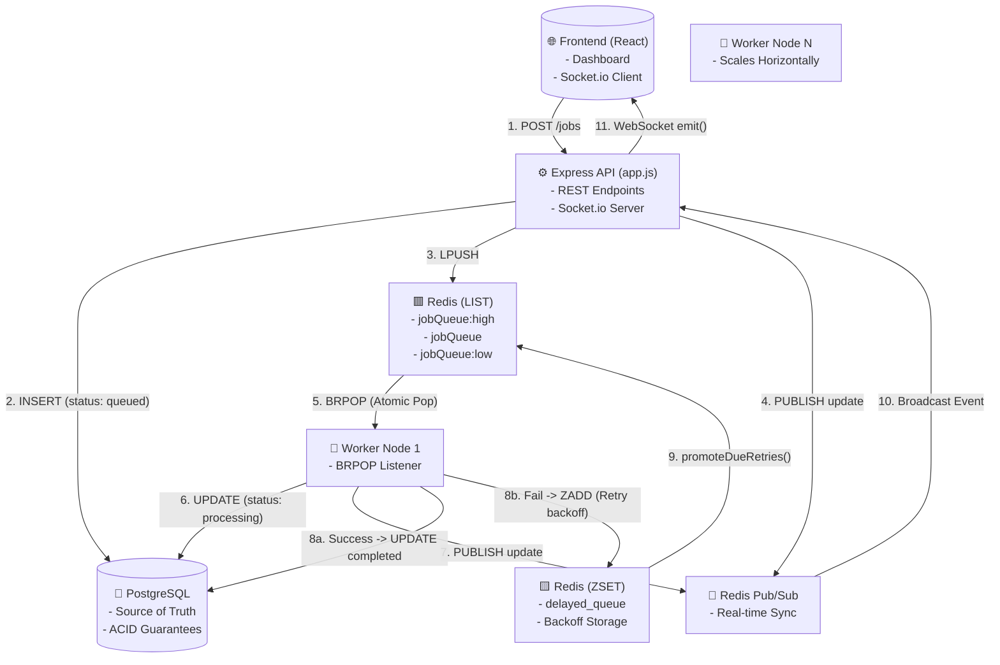
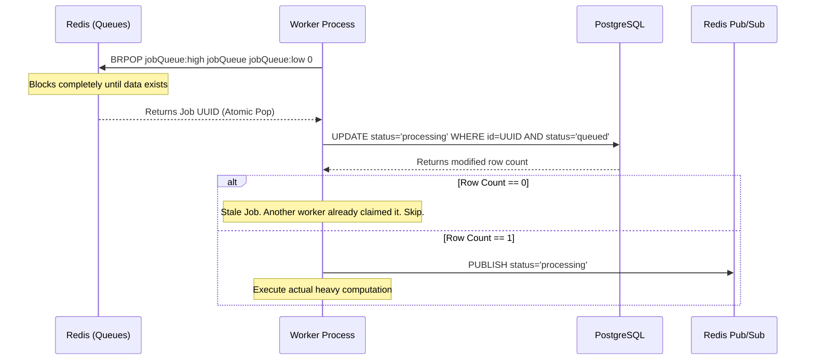
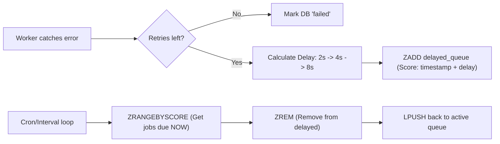

# QueueFlow: End-to-End Architectural Flow

This document details every single micro-interaction, database state change, and queue operation that occurs from the moment a user clicks "Create Job" to the moment the job finishes processing. It is designed to be the ultimate reference for system design interviews.

---

## 1. High-Level System Architecture Diagram



---

## 2. Step-by-Step Flow: Job Creation (The Producer)

When a user submits a job via the Dashboard or the `/jobs` REST endpoint, the system executes a strict sequence to ensure data durability before it even enters the queue.

### The Flow
1. **Request Received**: The API receives a `POST /jobs` payload containing the `type`, `payload`, and `priority`.
2. **Database Insertion (Source of Truth)**: 
   - The API instantly performs an `INSERT` into PostgreSQL. 
   - The job receives a UUID, a default `retry_count` of 0, and a `status` of `'queued'`.
   - *Why DB first?* If the API crashes *after* the DB insert but *before* pushing to Redis, our **Crash Recovery** script will find the orphaned job on reboot. If we pushed to Redis first, a crash would result in ghost jobs executing without a database record.
3. **Queue Push (Redis `LPUSH`)**: 
   - The API determines the correct Redis key based on priority (e.g., `jobQueue:high`).
   - It performs an O(1) `LPUSH` operation, pushing a lightweight JSON payload (just the ID, type, priority, and data) to the head of the Redis List.
4. **Real-time Sync (Pub/Sub)**:
   - The API uses `redis.publish('job_updates', ...)` to broadcast the newly created job.
   - The Socket.io server listens to this channel and blasts the new job to all connected frontend clients instantly.

---

## 3. Step-by-Step Flow: Worker Consumption

The worker nodes act as greedy consumers. You can spin up 10,000 of them, and they will never process the same job twice.



### The Race Condition Prevention (The Hardest Problem)
When multiple workers execute `BRPOP`, Redis guarantees that only **one** worker receives the popped element. However, what if a worker crashes, the job is recovered by the crash script, and *two* identical UUIDs end up in the Redis queue by accident?

We solve this using **Optimistic Concurrency Control** in PostgreSQL:
```sql
UPDATE jobs 
SET status = 'processing', processing_token = $2 
WHERE id = $1 AND status = 'queued'
```
Because of PostgreSQL's ACID guarantees and row-level locks, even if two workers try to execute this query at the exact same millisecond, only the first one will successfully change the status from `'queued'`. The second worker will get 0 rows returned, realize the job is stale, and safely drop it.

---

## 4. Step-by-Step Flow: Execution & Outcomes

Once the worker has claimed the job and locked it with a unique `processing_token`, it begins execution.

### Scenario A: Success
1. The worker finishes the simulated workload.
2. It executes an atomic `UPDATE` setting `status = 'completed'` where the `processing_token` matches.
3. It broadcasts a `completed` event via Redis Pub/Sub, updating the frontend instantly.

### Scenario B: Failure (Exception Thrown)
1. The worker catches the error.
2. It queries PostgreSQL for the current `retry_count` and `max_retries`.
3. If `retry_count < max_retries`, it triggers the **Exponential Backoff Flow** (see below).
4. If `retry_count == max_retries`, it marks the job as `failed` (Dead-letter), saves the error trace, and broadcasts the failure to the frontend.

---

## 5. Step-by-Step Flow: Exponential Backoff (Redis ZSET)

When a job fails but has retries remaining, we do NOT want to put it back into the queue immediately. That causes a "Thundering Herd" where a failing API gets hammered repeatedly. We must delay it.



### The ZSET Mechanics
1. **Scoring**: When the worker schedules a retry, it calculates the delay (e.g., 4000ms). It sets the Redis ZSET `score` to the exact UNIX timestamp of when the job should be executed (`Date.now() + 4000`).
2. **Storage**: It uses `ZADD delayed_queue <score> <job_payload>`. Because it's stored in Redis, the delay is 100% durable. If the worker crashes, the timer is still ticking in Redis.
3. **Promotion**: Every second, a background function (`promoteDueRetries`) runs `ZRANGEBYSCORE delayed_queue 0 <current_timestamp>`. It grabs all jobs whose time has come, removes them from the ZSET using `ZREM`, and pushes them back to standard lists via `LPUSH`.

---

## 6. Step-by-Step Flow: Crash Recovery

Distributed systems fail. A worker node could lose power halfway through processing a job, or it could crash immediately after taking a job from Redis but before updating the DB.

### The Startup Recovery Algorithm
Every time a Worker Node boots up, before it connects to `BRPOP`, it runs a two-step recovery process:

1. **Recovering Orphaned Jobs (Missing from Redis):**
   - It queries PostgreSQL: `SELECT id FROM jobs WHERE status = 'queued'`.
   - It queries Redis: Give me every job currently sitting in the lists and ZSETs.
   - It compares them. If a job is `queued` in the DB but nowhere to be found in Redis, it means a crash happened immediately after DB insertion. The worker re-pushes it to Redis.
2. **Recovering Stalled Jobs (Zombie Processing):**
   - It queries PostgreSQL for jobs stuck in `processing`: `WHERE status = 'processing' AND updated_at < NOW() - 60 seconds`.
   - If a job has been processing for longer than the maximum timeout limit (60s), it assumes the worker holding it has died silently.
   - It resets the status to `queued` and re-pushes it to Redis to be picked up by a healthy worker.

---

⚡ **Application in QueueFlow Project**
*Every single flow above is physically implemented in the codebase. The Atomic Claims live in `worker.js -> handleJob()`. The ZSET backoff lives in `scheduleRetry()` and `promoteDueRetries()`. The real-time Pub/Sub sync lives in `app.js` Socket.io listeners and `App.jsx` React state updates.*
